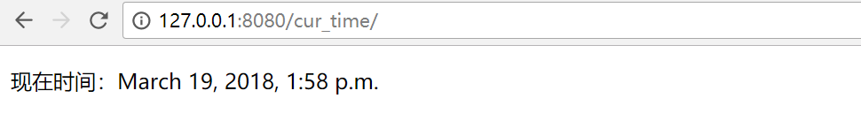

### django基础

#### MVC和MTV模式

著名的MVC模式：所谓MVC就是把web应用分为模型(M),控制器(C),视图(V)三层；他们之间以一种插件似的，松耦合的方式连接在一起。

模型负责业务对象与数据库的对象(ORM),视图负责与用户的交互(页面)，控制器(C)接受用户的输入调用模型和视图完成用户的请求。

Django的MTV模式本质上与MVC模式没有什么差别，也是各组件之间为了保持松耦合关系，只是定义上有些许不同，Django的MTV分别代表：

       Model(模型)：负责业务对象与数据库的对象(ORM)

       Template(模版)：负责如何把页面展示给用户

       View(视图)：负责业务逻辑，并在适当的时候调用Model和Template

       此外，Django还有一个url分发器，它的作用是将一个个URL的页面请求分发给不同的view处理，view再调用相应的Model和Template


####  django的流程和命令行工具

##### django的命令行工具

django-admin.py 是Django的一个用于管理任务的命令行工具，manage.py是对django－admin.py的简单包装,每一个Django Project里都会有一个mannage.py。

<1> 创建一个django工程 : django-admin.py startproject mysite

目录结构如下：


解释说明:


- manage.py ----- Django项目里面的工具，通过它可以调用django shell和数据库等。
- settings.py ---- 包含了项目的默认设置，包括数据库信息，调试标志以及其他一些工作的变量。
- urls.py ----- 负责把URL模式映射到应用程序。

<2>在mysite目录下创建blog应用: python manage.py startapp blog


<3>启动django项目：python manage.py runserver 8080

这样我们的django就启动起来了！当我们访问：http://127.0.0.1:8080/时就可以看到：


<4>生成同步数据库的脚本：python manage.py makemigrations  

同步数据库:  python manage.py migrate   

<5>访问后台管理

访问http://127.0.0.1:8080/admin/

 所以我们需要为进入这个项目的后台创建超级管理员：python manage.py createsuperuser，设置好用户名和密码后便可登录啦！

<6>清空数据库：python manage.py  flush

<7>查询某个命令的详细信息： django-admin.py  help  startapp

admin 是Django 自带的一个后台数据库管理系统。

<8>启动交互界面 ：python manage.py  shell

这个命令和直接运行 python 进入 shell 的区别是：你可以在这个 shell 里面调用当前项目的 models.py 中的 API，对于操作数据，还有一些小测试非常方便。

<9> 终端上输入python manage.py 可以看到详细的列表，在忘记子名称的时候特别有用

####django URL

 URL配置(URLconf)就像Django 所支撑网站的目录。它的本质是URL模式以及要为该URL模式调用的视图函数之间的映射表；你就是以这种方式告诉Django，对于这个URL调用这段代码，对于那个URL调用那段代码。

语法:

```
urlpatterns = [
    url(正则表达式, views视图函数，参数，别名),
]
```
参数说明：

- 一个正则表达式字符串
- 一个可调用对象，通常为一个视图函数或一个指定视图函数路径的字符串
- 可选的要传递给视图函数的默认参数（字典形式）
- 一个可选的name参数

##### 实例说明

1 第一个加第二个参数的使用

首先写url以及一个视图函数
```
from django.conf.urls import url
from django.contrib import admin
from blog import views

urlpatterns = [
    url(r'^admin/', admin.site.urls),
    url(r'^cur_time/',views.cur_time),
]

```
2 然后写视图函数

```
from django.shortcuts import render,HttpResponse

# Create your views here.
import datetime
def cur_time(requests):

    return HttpResponse('<h1>ok</h1')
```
这样一个简单的流程就写完了，浏览器访问


2.1以上返回一个页面
```
from django.shortcuts import render,HttpResponse

# Create your views here.
import datetime
def cur_time(requests):

    date1 = datetime.datetime.now()

    # return HttpResponse('<h1>ok</h1')
    return render(requests,'cur_time.html',{'abc':date1})   --->传变量到模板里面必须这样写{}
```

然后再templates下面创建一个cur_time.html,就可以引用“abc”了

```
cur_time.html

<!DOCTYPE html>
<html lang="en">
<head>
    <meta charset="UTF-8">
    <title>现在时间</title>
</head>
<p>现在时间：{{ abc }}</p>
<body>

</body>
</html>
```
然后浏览器访问http://127.0.0.1:8080/cur_time/



#####  URL支持正则

```
urlpatterns = [

    url(r'^articles/2003/$', views.special_case_2003),

    #url(r'^articles/[0-9]{4}/$', views.year_archive),

    url(r'^articles/([0-9]{4})/$', views.year_archive),  #no_named group

    url(r'^articles/([0-9]{4})/([0-9]{2})/$', views.month_archive),

    url(r'^articles/([0-9]{4})/([0-9]{2})/([0-9]+)/$', views.article_detail),

]
```

一些特殊常用的正则

```
import re

ret=re.search('(?P<id>\d{3})/(?P<name>\w{3})','weeew34ttt123/ooo')

print(ret.group())     --->123/ooo
print(ret.group('id'))  --->123
print(ret.group('name')) ---->ooo

个人理解：
有名变量的匹配,意思是匹配3个数字,====》匹配出来之后可以有个名字叫做id，以及3个字符串===可以有个名字叫做name，用name来替代
```
简单使用实例

```
url.py

urlpatterns = [
    url(r'^admin/', admin.site.urls),
    #year,month可以作为变量的参数传到后端view
    url(r'^articles/(?P<year>[0-9]{4})/(?P<month>[0-9{2})/',views.year_archive),

]

views.py

这里面的参数必须加而且必须保持名字和url里面的一致

def year_archive(req,year,month):

    return HttpResponse("year"+year+"month"+month)


浏览器访问即可获取到year,month
```
简要说明一点：

```
#url在匹配的时候加上()表示可以传这个变量到views视图函数里面


 url(r'^articles/([0-9]{4})/([0-9]{2})/',views.year_archive)   
其中()()这两个在传到后台views的时候，在函数year_archive必须要有两个参数不然会报错


views.py
def year_archive(req,year,m):   -->必须是两个参数，不然会报错

    return HttpResponse("year"+year+"month"+m)
```
##### 第三个参数

第三个参数的主要作用也是把变量传到views里面,参数是个字典的形式{}

```
urls.py


    #第三个参数--->name作为变量传入views
    url(r'^index',views.index,{"name":"alex"}),

views.py
  
---name这个参数必须有也必须和urls里面的一样，不然会报错

def index(req,name):
    return HttpResponse(name)


浏览器访问，获得到name的值alex
```
##### 第四个参数name，

固定写法，必须写成name=xxx，主要作用是给前边的url做个别名传给html用
```
urls.py


 #name变量是固定写法,主要作用是给前边的url做个别名传给html用———>login.html
url(r'^index',views.index,name='alex'),


views.py

def index(req):
    if req.method=="POST":
        username=req.POST.get("username")
        pwd=req.POST.get("pwd")
        if username=="alex" and pwd=="123":
            return  HttpResponse("登陆成功")

    return render(req,"login.html")


templates/login.html

<!DOCTYPE html>
<html lang="en">
<head>
    <meta charset="UTF-8">
    <title>Title</title>
</head>
<body>
{#//寻找url里面name="alex"的#}
{#<form action="" method="post">#}
    <input type="text" name="username">
    <input type="password" name="pwd">
    <input type="submit" value="submit">
</form>

</body>
</html>
 

  ---->会替换成urls里面的index,即使以后index改变，这里还是会保持不变，依然能够解析出来替换后的url

```

最后一点

```
由于项目多了起来之后url也会多了起来，所以我们将每个项目的url单独写在每个项目，然后在将项目的url引入总的url

from django.conf.urls import include, url

urlpatterns = [
   url(r'^admin/', admin.site.urls),
   url(r'^blog/', include('blog.urls')),
]

在APP里面创建一个urls.py文件，然后所有的关于这个项目的都写在这里面就行了。
```
#### django视图函数


