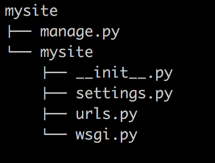

### django基础

#### MVC和MTV模式

著名的MVC模式：所谓MVC就是把web应用分为模型(M),控制器(C),视图(V)三层；他们之间以一种插件似的，松耦合的方式连接在一起。

模型负责业务对象与数据库的对象(ORM),视图负责与用户的交互(页面)，控制器(C)接受用户的输入调用模型和视图完成用户的请求。

Django的MTV模式本质上与MVC模式没有什么差别，也是各组件之间为了保持松耦合关系，只是定义上有些许不同，Django的MTV分别代表：

       Model(模型)：负责业务对象与数据库的对象(ORM)

       Template(模版)：负责如何把页面展示给用户

       View(视图)：负责业务逻辑，并在适当的时候调用Model和Template

       此外，Django还有一个url分发器，它的作用是将一个个URL的页面请求分发给不同的view处理，view再调用相应的Model和Template


####  django的流程和命令行工具

##### django的命令行工具

django-admin.py 是Django的一个用于管理任务的命令行工具，manage.py是对django－admin.py的简单包装,每一个Django Project里都会有一个mannage.py。

<1> 创建一个django工程 : django-admin.py startproject mysite

目录结构如下：



解释说明:


- manage.py ----- Django项目里面的工具，通过它可以调用django shell和数据库等。
- settings.py ---- 包含了项目的默认设置，包括数据库信息，调试标志以及其他一些工作的变量。
- urls.py ----- 负责把URL模式映射到应用程序。

<2>在mysite目录下创建blog应用: python manage.py startapp blog


<3>启动django项目：python manage.py runserver 8080

这样我们的django就启动起来了！当我们访问：http://127.0.0.1:8080/时就可以看到：


<4>生成同步数据库的脚本：python manage.py makemigrations  

同步数据库:  python manage.py migrate   

<5>访问后台管理

访问http://127.0.0.1:8080/admin/

 所以我们需要为进入这个项目的后台创建超级管理员：python manage.py createsuperuser，设置好用户名和密码后便可登录啦！

<6>清空数据库：python manage.py  flush

<7>查询某个命令的详细信息： django-admin.py  help  startapp

admin 是Django 自带的一个后台数据库管理系统。

<8>启动交互界面 ：python manage.py  shell

这个命令和直接运行 python 进入 shell 的区别是：你可以在这个 shell 里面调用当前项目的 models.py 中的 API，对于操作数据，还有一些小测试非常方便。

<9> 终端上输入python manage.py 可以看到详细的列表，在忘记子名称的时候特别有用

####django URL

 URL配置(URLconf)就像Django 所支撑网站的目录。它的本质是URL模式以及要为该URL模式调用的视图函数之间的映射表；你就是以这种方式告诉Django，对于这个URL调用这段代码，对于那个URL调用那段代码。

语法:

```
urlpatterns = [
    url(正则表达式, views视图函数，参数，别名),
]
```
参数说明：

- 一个正则表达式字符串
- 一个可调用对象，通常为一个视图函数或一个指定视图函数路径的字符串
- 可选的要传递给视图函数的默认参数（字典形式）
- 一个可选的name参数

##### 实例说明

1 第一个加第二个参数的使用

首先写url以及一个视图函数
```
from django.conf.urls import url
from django.contrib import admin
from blog import views

urlpatterns = [
    url(r'^admin/', admin.site.urls),
    url(r'^cur_time/',views.cur_time),
]

```
2 然后写视图函数

```
from django.shortcuts import render,HttpResponse

# Create your views here.
import datetime
def cur_time(requests):

    return HttpResponse('<h1>ok</h1')
```
这样一个简单的流程就写完了，浏览器访问


2.1以上返回一个页面
```
from django.shortcuts import render,HttpResponse

# Create your views here.
import datetime
def cur_time(requests):

    date1 = datetime.datetime.now()

    # return HttpResponse('<h1>ok</h1')
    return render(requests,'cur_time.html',{'abc':date1})   --->传变量到模板里面必须这样写{}
```

然后再templates下面创建一个cur_time.html,就可以引用“abc”了

```
cur_time.html

<!DOCTYPE html>
<html lang="en">
<head>
    <meta charset="UTF-8">
    <title>现在时间</title>
</head>
<p>现在时间：{{ abc }}</p>
<body>

</body>
</html>
```
然后浏览器访问http://127.0.0.1:8080/cur_time/


#####  URL支持正则

```
urlpatterns = [

    url(r'^articles/2003/$', views.special_case_2003),

    #url(r'^articles/[0-9]{4}/$', views.year_archive),

    url(r'^articles/([0-9]{4})/$', views.year_archive),  #no_named group

    url(r'^articles/([0-9]{4})/([0-9]{2})/$', views.month_archive),

    url(r'^articles/([0-9]{4})/([0-9]{2})/([0-9]+)/$', views.article_detail),

]
```

一些特殊常用的正则

```
import re

ret=re.search('(?P<id>\d{3})/(?P<name>\w{3})','weeew34ttt123/ooo')

print(ret.group())     --->123/ooo
print(ret.group('id'))  --->123
print(ret.group('name')) ---->ooo

个人理解：
有名变量的匹配,意思是匹配3个数字,====》匹配出来之后可以有个名字叫做id，以及3个字符串===可以有个名字叫做name，用name来替代
```
简单使用实例

```
url.py

urlpatterns = [
    url(r'^admin/', admin.site.urls),
    #year,month可以作为变量的参数传到后端view
    url(r'^articles/(?P<year>[0-9]{4})/(?P<month>[0-9{2})/',views.year_archive),

]

views.py

这里面的参数必须加而且必须保持名字和url里面的一致

def year_archive(req,year,month):

    return HttpResponse("year"+year+"month"+month)


浏览器访问即可获取到year,month
```
简要说明一点：

```
#url在匹配的时候加上()表示可以传这个变量到views视图函数里面


 url(r'^articles/([0-9]{4})/([0-9]{2})/',views.year_archive)   
其中()()这两个在传到后台views的时候，在函数year_archive必须要有两个参数不然会报错


views.py
def year_archive(req,year,m):   -->必须是两个参数，不然会报错

    return HttpResponse("year"+year+"month"+m)
```
##### 第三个参数

第三个参数的主要作用也是把变量传到views里面,参数是个字典的形式{}

```
urls.py


    #第三个参数--->name作为变量传入views
    url(r'^index',views.index,{"name":"alex"}),

views.py
  
---name这个参数必须有也必须和urls里面的一样，不然会报错

def index(req,name):
    return HttpResponse(name)


浏览器访问，获得到name的值alex
```
##### 第四个参数name，

固定写法，必须写成name=xxx，主要作用是给前边的url做个别名传给html用
```
urls.py


 #name变量是固定写法,主要作用是给前边的url做个别名传给html用———>login.html
url(r'^index',views.index,name='alex'),


views.py

def index(req):
    if req.method=="POST":
        username=req.POST.get("username")
        pwd=req.POST.get("pwd")
        if username=="alex" and pwd=="123":
            return  HttpResponse("登陆成功")

    return render(req,"login.html")


templates/login.html

<!DOCTYPE html>
<html lang="en">
<head>
    <meta charset="UTF-8">
    <title>Title</title>
</head>
<body>
{#//寻找url里面name="alex"的#}
{#<form action="" method="post">#}
    <input type="text" name="username">
    <input type="password" name="pwd">
    <input type="submit" value="submit">
</form>

</body>
</html>
 

  ---->会替换成urls里面的index,即使以后index改变，这里还是会保持不变，依然能够解析出来替换后的url

```

最后一点

```
由于项目多了起来之后url也会多了起来，所以我们将每个项目的url单独写在每个项目，然后在将项目的url引入总的url

from django.conf.urls import include, url

urlpatterns = [
   url(r'^admin/', admin.site.urls),
   url(r'^blog/', include('blog.urls')),
]

在APP里面创建一个urls.py文件，然后所有的关于这个项目的都写在这里面就行了。
```
### django的setting设置

#### static配置

需要在setting.py里面加上静态文件配置

```
STATIC_URL = '/static/'  #alias别名的意思,调用的时候是用的它

#实际的路径===>statics与创建的包的名字一样,通过下边可以找到ststics目录
STATICFILES_DIRS = (
    os.path.join(BASE_DIR,"statics"),
)

```

1 创建statics包，里面放入静态文件js等(跟创建的项目同级)

2 在templates的html文件里面调用的写法如下

引入    #必须引入

写入
<script src=""></script>
```
   #必须引入
<!DOCTYPE html>
<html lang="en">
<head>
    <meta charset="UTF-8">

    <title>Title</title>
    <style>
        * {
            margin: 0;
            padding: 0;
        }
        .head{
            line-height: 40px;
            background-color: green;
            color:white;
            text-align: center;
        }
    </style>
</head>
<body>

<h1>hello world {{ time  }}</h1>
{#<script src="/static/jquery-3.1.1.js"></script>#} #第一种写法
<script src=""></script> #第二种写法

<script>
    $("h1").css("color","red")
</script>
</div>
</body>
</html>

```
实际目录结构如下
```
├── mysite
│   ├── blog
│   ├── mysite
|   |—— statics
|   |—— templates 
```

### django的视图函数说明

http请求中产生两个核心对象：

        http请求：HttpRequest对象

        http响应：HttpResponse对象

所在位置：django.http

##### request的属性跟方法

```
# path：       请求页面的全路径，不包括域名
#
# method：     请求中使用的HTTP方法的字符串表示。全大写表示。例如
#
#                    if  req.method=="GET":
#
#                              do_something()
#
#                    elseif req.method=="POST":
#
#                              do_something_else()
#
# GET:         包含所有HTTP GET参数的类字典对象
#
# POST：       包含所有HTTP POST参数的类字典对象
#
#              服务器收到空的POST请求的情况也是可能发生的，也就是说，表单form通过
#              HTTP POST方法提交请求，但是表单中可能没有数据，因此不能使用
#              if req.POST来判断是否使用了HTTP POST 方法；应该使用  if req.method=="POST"
#
#
#
# COOKIES:     包含所有cookies的标准Python字典对象；keys和values都是字符串。
#
# FILES：      包含所有上传文件的类字典对象；FILES中的每一个Key都是<input type="file" name="" />标签中                     name属性的值，FILES中的每一个value同时也是一个标准的python字典对象，包含下面三个Keys：
#
#             filename：      上传文件名，用字符串表示
#             content_type:   上传文件的Content Type
#             content：       上传文件的原始内容
#
#
# user：       是一个django.contrib.auth.models.User对象，代表当前登陆的用户。如果访问用户当前
#              没有登陆，user将被初始化为django.contrib.auth.models.AnonymousUser的实例。你
#              可以通过user的is_authenticated()方法来辨别用户是否登陆：
#              if req.user.is_authenticated();只有激活Django中的AuthenticationMiddleware
#              时该属性才可用
#
# session：    唯一可读写的属性，代表当前会话的字典对象；自己有激活Django中的session支持时该属性才可用。

#方法
get_full_path(),   比如：http://127.0.0.1:8000/index33/?name=123 ,req.get_full_path()得到的结果就是/index33/?name=123
req.path:/index33
```
具体实例

```
urls.py

url(r'register',views.register)

views.py

def register(request):
    if request.method == "POST":
        print (request.POST)
        print (request.POST.getlist("username"))

        return HttpResponse("注册成功")
    return render(request,"register.html", locals())

temlpates/register.html

<!DOCTYPE html>
<html lang="en">
<head>
    <meta charset="UTF-8">
    <title>Title</title>
</head>
<body>


<form action="/blog/register/" method="POST">
    <p>姓名<input type="text" name="username"></p>
    <p>性别<input type="text" name="sex"></p>
    <p>邮箱<input type="text" name="email"></p>
    <p>密码<input type="password" name="pwd"></p>
    <p><input type="submit" value="submit"></p>
</form>


</body>
</html>

```

##### render 与  redirect

redirect 是直接会跳转新的请求url页面,登录验证的时候可能会用到

render 会在当前页url不会改变

页面跳转：         redirect("路径")

locals()：    可以直接将函数中所有的变量传给模板

### 模板介绍

#### 变量引用

 变量（使用双大括号来引用变量）：

```
{{ var_name }}
```
模板引用变量的原理

#### Template和Context对象

```
>>> python manange.py shell  (进入该django项目的环境)
>>> from django.template import Context, Template
>>> t = Template('My name is {{ name }}.')
>>> c = Context({'name': 'Stephane'})
>>> t.render(c)
'My name is Stephane.'
```

Django 模板解析非常快捷。 大部分的解析工作都是在后台通过对简短正则表达式一次性调用来完成。 这和基于 XML 的模板引擎形成鲜明对比，那些引擎承担了 XML 解析器的开销，且往往比 Django 模板渲染引擎要慢上几个数量级。

#### 万能的句点号

在到目前为止的例子中，我们通过 context 传递的简单参数值主要是字符串，然而，模板系统能够非常简洁地处理更加复杂的数据结构，例如list、dictionary和自定义的对象。

具体实例

```
urls.py

url(r'test', views.test)

views.py

class Animal:
    def __init__(self,name,age):
        self.name=name
        self.age=age
def test(request):

    l = ['张三','李四','王二','小五']

    dic_person = {"name":'zdk',"age":18,"hobby":"play"}

    animal = Animal("小白兔",2)

    render(request,"test.html",locals())


templates/test.html

<!DOCTYPE html>
<html lang="en">
<head>
    <meta charset="UTF-8">
    <title>Title</title>
</head>
<body>

{#列表取数#}

<p>名字是:{{ l.0 }}</p>
<p>字典取数:</p>
<p>{{ dic_person.name }}</p>
<p>{{ dic_person.hobby }}</p>
<p>类取数</p>
<p>{{ animal.age }}</p>
<p>{{ animal.name }}</p>

</body>
</html>


```
#### 过滤器(filter)

常用的几个

```
 # 1  add          ：   给变量加上相应的值
   #
   # 2  addslashes   :    给变量中的引号前加上斜线
   #
   # 3  capfirst     :    首字母大写
   #
   # 4  cut          ：   从字符串中移除指定的字符
   #
   # 5  date         ：   格式化日期字符串
   #
   # 6  default      ：   如果值是False,就替换成设置的默认值，否则就是用本来的值
   #
   # 7  default_if_none:  如果值是None，就替换成设置的默认值，否则就使用本来的值
```
实例如下

```
#value1="aBcDe"
{{ value1|upper }}<br>

#value2=5
{{ value2|add:3 }}<br>

#value3='he  llo wo r ld'
{{ value3|cut:' ' }}<br>

#import datetime
#value4=datetime.datetime.now()
{{ value4|date:'Y-m-d' }}<br>

#value5=[]
{{ value5|default:'空的' }}<br>

#value6='<a href="#">跳转</a>'

{{ value6 }}  #默认是不解析的

 #让浏览器解析
  {{ value6 }}


{{ value6|safe }}<br>#让浏览器解析出a标签 <a href="#">click</a>

{{ value6|striptags }} #浏览器解析出标签,但是没办法点击 <h1>click</h1>

#value7='1234'
{{ value7|filesizeformat }}<br>
{{ value7|first }}<br>
{{ value7|length }}<br>
{{ value7|slice:":-1" }}<br>

#value8='http://www.baidu.com/?a=1&b=3'
{{ value8|urlencode }}<br>  #url编码
    value9='hello I am yuan'
```
####  标签(tag)的使用（使用大括号和百分比的组合来表示使用tag）

#####  的使用

```

一般用法



```
具体实例

标签计算一个变量值，如果是“true”，即它存在、不为空并且不是false的boolean值,系统则会显示和间的所有内容
```


    
        <p>num大于200</p>
    
        <p>num大于100小于200</p>
    


    <p>num小于100</p>


    <p>num等于100</p>



 标签接受and，or或者not来测试多个变量值或者否定一个给定的变量
 标签不允许同一标签里同时出现and和or，否则逻辑容易产生歧义，例如下面的标签是不合法的：


```

##### 的使用

```
语法


```
实例如下

```
<ul>

    <li>{{ obj.name }}</li>

</ul>


#在标签里添加reversed来反序循环列表：

    
    ...
    

#标签可以嵌套：

    
        <h1>{{ country.name }}</h1>
        <ul>
         
            <li>{{ city }}</li>
         
        </ul>
    


#系统不支持中断循环，系统也不支持continue语句，标签内置了一个forloop模板变量，
#这个变量含有一些属性可以提供给你一些关于循环的信息

1，forloop.counter表示循环的次数，它从1开始计数，第一次循环设为1:

    
        <p>{{ forloop.counter }}: {{ item }}</p>
    
2，forloop.counter0 类似于forloop.counter，但它是从0开始计数，第一次循环设为0
3，forloop.revcounter
4，forloop.revcounter0
5，forloop.first当第一次循环时值为True，在特别情况下很有用：

       
         <li class="first"><li>   
         {{ object }}   
        </li>  
      
    
# 富有魔力的forloop变量只能在循环中得到，当模板解析器到达时forloop就消失了
# 如果你的模板context已经包含一个叫forloop的变量，Django会用标签替代它
# Django会在for标签的块中覆盖你定义的forloop变量的值
# 在其他非循环的地方，你的forloop变量仍然可用


#

{{li }}
      
          <li>{{ forloop.counter0 }}----{{ i }}</li>
      
          <li>this is empty!</li>
      

#         [11, 22, 33, 44, 55]
#            0----11
#            1----22
#            2----33
#            3----44
#            4----55
```
##### ：csrf_token标签

用于生成csrf_token的标签，用于防治跨站攻击验证。注意如果你在view的index里用的是render_to_response方法，不会生效其实，这里是会生成一个input标签，和其他表单标签一起提交给后台的。

在post请求的时候用的比较多

#####:  引用路由配置的地址

```
urls.py
url(r'register',views.register,name='xxx'),

templates/xx.html

<form action="" method="POST">
```
##### :用更简单的变量名替代复杂的变量名

```
 {{ total }} 
```

##### load

load主要加载静态文件以及自定义过滤器以及自定义的标签



##### 自定义filter以及标签

第一步:在app(例如blog这个app中)中创建templatetags模块(必须的)

第二步:创建任意 .py 文件，如：my_tags.py

开始创建

```
from django import template
from django.utils.safestring import mark_safe

register = template.Library()   #register的名字是固定的,不可改变


@register.filter
def filter_multi(v1,v2):
    return  v1 * v2


@register.simple_tag
def simple_tag_multi(v1,v2):
    return  v1 * v2


@register.simple_tag
def my_input(id,arg):
    result = "<input type='text' id='%s' class='%s' />" %(id,arg,)
    return mark_safe(result)

```
第三步在使用自定义simple_tag和filter的html文件中导入之前创建的 my_tags.py ：

调用使用simple_tag和filter

```
-------------------------------.html
   #首行
    
    
    
    
 # num=12
{{ num|filter_multi:2 }} #24

{{ num|filter_multi:"[22,333,4444]" }}


  参数不限,但不能放在if for语句中

```
最后

在settings中的INSTALLED_APPS配置当前app，不然django无法找到自定义的simple_tag

filter可以用在if等语句后，simple_tag不可以

```

    {{ num|filter_multi:30 }}

```
####  extend模板继承

##### 

在讲解了模板加载机制之后，我们再介绍一个利用该机制的内建模板标签：  。该标签允许在（模板中）包含其它的模板的内容。 标签的参数是所要包含的模板名称，可以是一个变量，也可以是用单/双引号硬编码的字符串。 每当在多个模板中出现相同的代码时，就应该考虑是否要使用  来减少重复。

可以在 HTML 页面中使用该指令将一个网页嵌入到另一个中

事例

```

```

##### extend模版继承

1 定义基础模板

```
<!DOCTYPE HTML PUBLIC "-//W3C//DTD HTML 4.01//EN">
<html lang="en">
<head>
    <title></title>
</head>
<body>
    <h1>My helpful timestamp site</h1>
    
    
    <hr>
    <p>Thanks for visiting my site.</p>
    
</body>
</html>
```
block的地方都是在子模板中可以修改的地方

说明:

这个叫做 base.html 的模板定义了一个简单的 HTML 框架文档，我们将在本站点的所有页面中使用。 子模板的作用就是重载、添加或保留那些块的内容。 （如果你一直按顺序学习到这里，保存这个文件到你的template目录下，命名为 base.html .）

我们使用模板标签：  。 所有的  标签告诉模板引擎，子模板可以重载这些部分。 每个标签所要做的是告诉模板引擎，该模板下的这一块内容将有可能被子模板覆盖。

2 子模板继承并且修改

```

 
The current time
 

<p>It is now {{ current_date }}.</p>

```

其他的子模板继承

```

 
Future time
 

<p>In {{ hour_offset }} hour(s), it will be {{ next_time }}.</p>

```

每个模板只包含对自己而言 独一无二 的代码。 无需多余的部分。 如果想进行站点级的设计修改，仅需修改 base.html ，所有其它模板会立即反映出所作修改。

??? note "注意点"
    ```
    <1>如果在模板中使用  ，必须保证其为模板中的第一个模板标记。 否则，模板继承将不起作用。

    <2>一般来说，基础模板中的  标签越多越好。 记住，子模板不必定义父模板中所有的代码块，因此
    你可以用合理的缺省值对一些代码块进行填充，然后只对子模板所需的代码块进行（重）定义。 俗话说，钩子越
    多越好。

    <3>如果发觉自己在多个模板之间拷贝代码，你应该考虑将该代码段放置到父模板的某个  中。
    如果你需要访问父模板中的块的内容，使用 {{ block.super }}这个标签吧，这一个魔法变量将会表现出父模
    板中的内容。 如果只想在上级代码块基础上添加内容，而不是全部重载，该变量就显得非常有用了。

    <4>不允许在同一个模板中定义多个同名的  。 存在这样的限制是因为block 标签的工作方式是双向的。
    也就是说，block 标签不仅挖了一个要填的坑，也定义了在父模板中这个坑所填充的内容。如果模板中出现了两个
    相同名称的  标签，父模板将无从得知要使用哪个块的内容。
    ```
