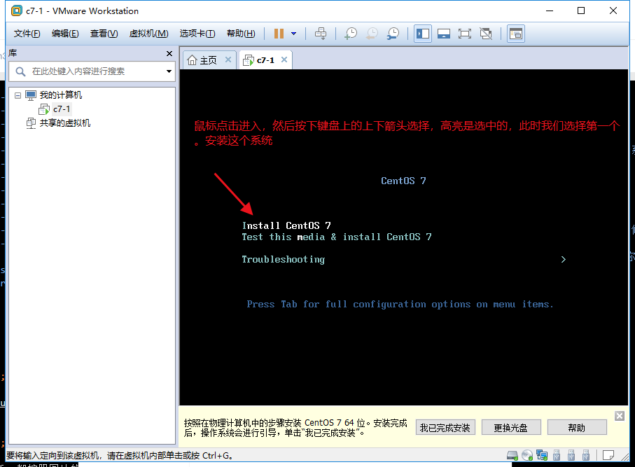

<center><h1>操作系统安装</h1></center>


## 1. 准备环境
&#160; &#160; &#160; &#160;在没安装之前，我先普及一下虚拟化软件。系统镜像等概念。已经你接下来需要做是什么。
### 1.1 系统
&#160; &#160; &#160; &#160;系统对我们来说最常见了，比如Windows XP, Windows 7，Windows 10等等，都是我们生活中常见的。还有一个背后比Window更强大的开源（免费试用，windows正版需要买）操作系统，那就是Linux，接下来我们就打开这个神秘的面纱。

&#160; &#160; &#160; &#160; 期中Linux系统又分好多（好比人分男人有女人，期中男人有分高矮胖瘦），互联网使用最多的linux操作系统那就是centos和ubuntu[开发用的比较多]。Linux系统也分有桌面系统和无桌面的系统。后面会主要以没有桌面[非图形化]的系统为例讲述。

### 1.2 虚拟机
&#160; &#160; &#160; &#160;平时我们常用的电脑都是windows系统的电脑。而我们将要学的是Linux操作系统，所以需要安装一个Linux系统，有以下常用的三个办法

- 双系统，也就是在windows电脑上在安装一个Linux的系统。
- Linux系统，直接把自己的电脑安装一个Linux系统。
- 虚拟机，我们在windows电脑上安装一个虚拟机，在虚拟机中再安装一个Linux系统

&#160; &#160; &#160; &#160;以上 我个人优先推荐使用最后一种方法。即使你虚拟机系统整坏了。你重新在虚拟机中安装一个Linux系统即可。双系统的话，要是双系统中任何有一个系统有问题都有可能导致你整个双系统有问题，甚至系统启动不了。

&#160; &#160; &#160; &#160;国内使用虚拟化软件的最多的就是VmWware，还有其他的如XBOX，openstack，KVM,XZEN，等等，期中Vmware是使用非常多的优秀桌面软件。

### 1.3 文件准备
&#160; &#160; &#160; &#160;我们需要准备一下软件

文件 | 说明
---|---
VMware WorkStation | 虚拟化软件
CentOS-7-x86_64-Minimal-1810|系统镜像

> 本教程以安装Centos7为系统镜像安装

系统可以到[163镜像上下载](http://mirrors.163.com/centos/7.6.1810/isos/x86_64/)

??? note "系统区别"
    ```python
    CentOS-7-x86_64-DVD-1810.iso                       26-Nov-2018 07:55      4G   DVD版本的镜像
    CentOS-7-x86_64-DVD-1810.torrent                   03-Dec-2018 23:03     86K   
    CentOS-7-x86_64-Everything-1810.iso                26-Nov-2018 22:28     10G   最全的系统镜像
    CentOS-7-x86_64-Everything-1810.torrent            03-Dec-2018 23:03    101K  
    CentOS-7-x86_64-LiveGNOME-1810.iso                 25-Nov-2018 01:41      1G   光盘上的系统，你可以通过光盘启动电脑，启动出一个Linux系统（类似于bin版本在安装结束后在硬盘上的状态），它也有图形界面，也有终端。
    CentOS-7-x86_64-LiveGNOME-1810.torrent             03-Dec-2018 23:03     28K   
    CentOS-7-x86_64-LiveKDE-1810.iso                   25-Nov-2018 01:53      2G   图形版本是KDE桌面系统
    CentOS-7-x86_64-LiveKDE-1810.torrent               03-Dec-2018 23:03     37K
    CentOS-7-x86_64-Minimal-1810.iso                   26-Nov-2018 05:25    918M   最小化的系统（不带图形界面）
    CentOS-7-x86_64-Minimal-1810.torrent               03-Dec-2018 23:03     36K
    CentOS-7-x86_64-NetInstall-1810.iso                26-Nov-2018 00:21    507M   通过网络安装(network install 缩写) 不建议因为安装的时候。会联网去下载必要的包，很慢。
    CentOS-7-x86_64-NetInstall-1810.torrent            03-Dec-2018 23:03     20K
    sha256sum.txt                                      01-Dec-2018 21:16     598   系统镜像的sha256的值(类似MD5的值，一种算法。为了防止你从网下下载下来的系统镜像不对，可以通过这个值来对比。)
    sha256sum.txt.asc                                  03-Dec-2018 22:50    1458
    期中后缀名是torrent都是迅雷下载的文件。也就是说先把这个下载下来，然后双击这个文件的话，直接迅雷弹出然后继续下载该系统
    ```


## 2. 安装
### 2.1 打开vmware
&#160; &#160; &#160; &#160;首先我们安装好vmware以后，双击打开vmware，新的安装的类似如下界面：


### 2.2 新建虚拟机
&#160; &#160; &#160; &#160;新建虚拟机也就是在你的windows电脑上开始新安装一个操作系统。

以下没有特殊说明的话，都按照图片的来


按照删除声卡方式一样。也把打印机也删除[减少笔记本的性能消耗]


&#160; &#160; &#160; &#160;配置完毕后，开始安装系统了。


&#160; &#160; &#160; &#160;进入系统后。我们鼠标点击进入，然后使用键盘上的上下箭头选择第一个[高亮为选中]

> 我们按下CTRL+ALT组合按钮。此时鼠标就会从虚拟机中脱离出来。



!!! note "解释"
    ```python
    1. Install Centos 7  安装Centos7 系统
    2. Test this media && Install Centos 7 先检查，系统盘是否有问题，没有问题在安装[别选择该项，自建非常的慢]
    3. Troubleshooting 修复现有的centos7 使用
    ```

按下Enter按键进行安装。


保持默认，点击右下角的Continue[中文是继续意思]


此时坐等系统安装完毕。看你电脑的配置如何了。SSD盘的应该很快的。
> 普及一下root用户。Linux有个超级管理员用户就是默认就是root用户[uid=0]，后面会详解这个

&#160; &#160; &#160; &#160;看到右下角的Reboot按钮。此时就看到系统已经安装完毕了。我们点击Reboot按钮重启。然后等待系统重启，重启的过程中不要任何操作。


看到如下图的`localhost login:`就说明重启OK了。 


&#160; &#160; &#160; &#160;到此为止，从系统的安装，配置系统，重启系统，登录系统。接下来我们就开始愉快的玩耍Linux系统了。

