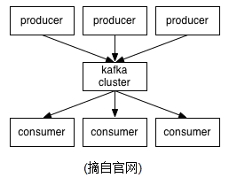
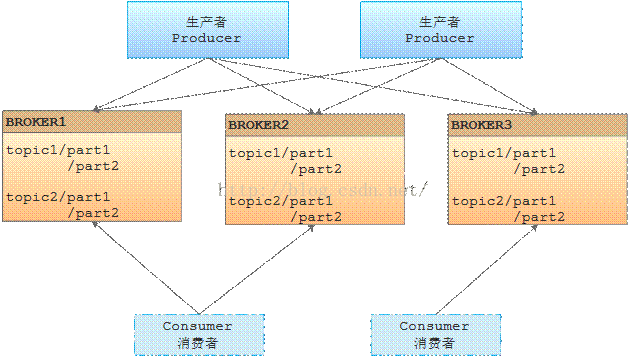
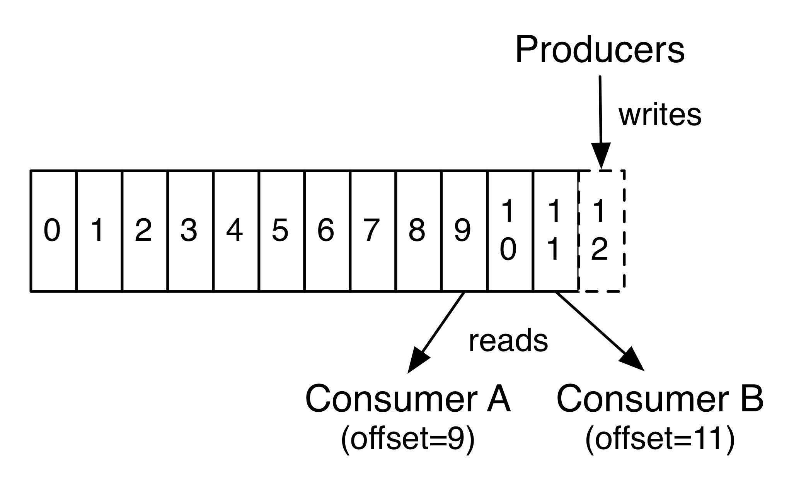

### kafka基础知识

- 几个概念

kafka作为一个集群运行在一个或多个服务器上。kafka集群存储的消息是以topic为类别记录的。每个消息（也叫记录record，我习惯叫消息）是由一个key，一个value和时间戳构成。

无论是kafka集群，还是producer和consumer都依赖于zookeeper来保证系统可用性集群保存一些meta信息。

### kafka有四个核心API：
- 应用程序使用 Producer API 发布消息到1个或多个topic（主题）。
- 应用程序使用 Consumer API 来订阅一个或多个topic，并处理产生的消息。
- 应用程序使用 Streams API 充当一个流处理器，从1个或多个topic消费输入流，并生产一个输出流到1个或多个输出topic，有效地将输入流转换到输出流。
- Connector API允许构建或运行可重复使用的生产者或消费者，将topic连接到现有的应用程序或数据系统。例如，一个关系数据库的连接器可捕获每一个变化。     

Client和Server之间的通讯，是通过一条简单、高性能并且和开发语言无关的TCP协议

### 首先来了解一下Kafka所使用的基本术语：

Topic
- Kafka将消息种子(Feed)分门别类，每一类的消息称之为一个主题(Topic)

Producer
- 发布消息的对象称之为主题生产者(Kafka topic producer)

Consumer
- 订阅消息并处理发布的消息的种子的对象称之为主题消费者(consumers)

Broker
- 已发布的消息保存在一组服务器中，称之为Kafka集群。集群中的每一个服务器都是一个代理(Broker). 消费者可以订阅一个或多个主题（topic），并从Broker拉数据，从而消费这些已发布的消息。

### topic与log

一个Topic可以认为是一类消息，每个topic将被分成多个partition(区),每个partition在存储层面是append log文件。任何发布到此partition的消息都会被直接追加到log文件的尾部，每条消息在文件中的位置称为offset（偏移量），offset为一个long型数字，它是唯一标记一条消息。它唯一的标记一条消息。kafka并没有提供其他额外的索引机制来存储offset，因为在kafka中几乎不允许对消息进行“随机读写”。每一个分区都是一个顺序的、不可变的消息队列.

Kafka集群保持所有的消息，直到它们过期， 无论消息是否被消费了。日志文件将会根据broker中的配置要求,保留一定的时间之后删除, 实际上消费者所持有的仅有的元数据就是这个偏移量，也就是消费者在这个log中的位置。 这个偏移量由消费者控制：正常情况当消费者消费消息的时候，偏移量也线性的的增加。但是实际偏移量由消费者控制，消费者可以将偏移量重置为更老的一个偏移量，重新读取消息。 可以看到这种设计对消费者来说操作自如， 一个消费者的操作不会影响其它消费者对此log的处理。

partitions的设计目的有多个.最根本原因是kafka基于文件存储.通过分区,可以将日志内容分散到多个server上,来避免文件尺寸达到单机磁盘的上限,每个partiton都会被当前server(kafka实例)保存;可以将一个topic切分多任意多个partitions,来消息保存/消费的效率.此外越多的partitions意味着可以容纳更多的consumer,有效提升并发消费的能力

### 分布式(Distribution)

一个Topic的多个partitions,被分布在kafka集群中的多个server上;每个server(kafka实例)负责partitions中消息的读写操作;此外kafka还可以配置partitions需要备份的个数(replicas),每个partition将会被备份到多台机器上,以提高可用性.
 
   基于replicated方案,那么就意味着需要对多个备份进行调度;每个partition都有一个server为"leader";leader负责所有的读写操作,如果leader失效,那么将会有其他follower来接管(成为新的leader);follower只是单调的和leader跟进,同步消息即可..由此可见作为leader的server承载了全部的请求压力,因此从集群的整体考虑,有多少个partitions就意味着有多少个"leader",kafka会将"leader"均衡的分散在每个实例上,来确保整体的性能稳定.

### 生产者(Producers)
生产者往某个Topic上发布消息。生产者也负责选择发布到Topic上的哪一个分区。最简单的方式从分区列表中轮流选择。也可以根据某种算法依照权重选择分区。开发者负责如何选择分区的算法。

### 消费者(Consumers)

通常来讲，消息模型可以分为两种， 队列和发布-订阅式。 
- 队列的处理方式是 一组消费者从服务器读取消息，一条消息只有其中的一个消费者来处理。
- 在发布-订阅模型中，消息被广播给所有的消费者，接收到消息的消费者都可以处理此消息。

消费者组
- Kafka为这两种模型提供了单一的消费者抽象模型： 消费者组 （consumer group）。  消费者用一个消费者组名标记自己。 一个发布在Topic上消息被分发给此消费者组中的一个消费者。 
- 假如所有的消费者都在一个组中，那么这就变成了queue模型。 
- 假如所有的消费者都在不同的组中，那么就完全变成了发布-订阅模型

更通用的， 我们可以创建一些消费者组作为逻辑上的订阅者。每个组包含数目不等的消费者， 一个组内多个消费者可以用来扩展性能和容错。正如下图所示：

### 因为Topic分区中消息只能由消费者组中的唯一一个消费者处理,将意味着某些consumer将无法得到消息.
 Kafka采用了一种分而治之的策略：分区。 因为Topic分区中消息只能由消费者组中的唯一一个消费者处理 ，所以消息肯定是按照先后顺序进行处理的。但是它也仅仅是保证Topic的一个分区顺序处理，不能保证跨分区的消息先后处理顺序。 
 ###### 所以，如果你想要顺序的处理Topic的所有消息，那就只提供一个分区

如上图所示

2个kafka集群托管4个分区（P0-P3)
2个消费者组，消费组A有2个消费者实例，消费组B有4个

按照以上说法，同一个组中的消费者不能消费同一个分区

### kafka的保证

1) 发送到partitions中的消息将会按照它接收的顺序追加到日志中
2) 对于消费者而言,它们消费消息的顺序和日志中消息顺序一致.
3) 如果Topic的"replicationfactor"为N,那么允许N-1个kafka实例失效.

### kafka作为一个存储系统
所有发布消息到消息队列和消费分离的系统，实际上都充当了一个存储系统（发布的消息先存储起来）。Kafka比别的系统的优势是它是一个非常高性能的存储系统。写入到kafka的数据将写到磁盘并复制到集群中保证容错性。并允许生产者等待消息应答，直到消息完全写入。kafka的磁盘结构 - 无论你服务器上有50KB或50TB，执行是相同的。client来控制读取数据的位置。你还可以认为kafka是一种专用于高性能，低延迟，提交日志存储，复制，和传播特殊用途的分布式文件系统。

### kafka使用场景
- 消息
- 指标
- 日志聚合
- 流处理等

