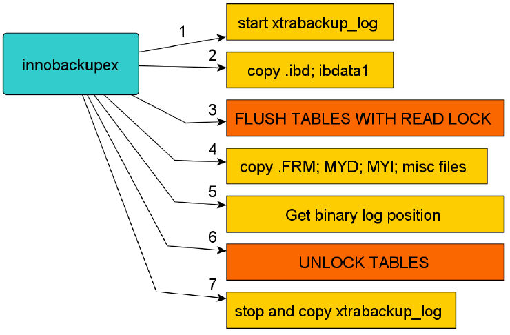

### Xtrabackup备份

#### 备份方式

- 热备份：读写不受影响（mysqldump → innodb）
- 温备份：仅可以执行读操作（mysqldump → myisam）
- 冷备份：离线备份，读写都不可用
- 逻辑备份：讲数据导出文本文件中(mysqldump)
- 物理备份：讲数据文件拷贝（xtrabackup，mysqlhotcopy）
- 完成备份：备份所有数据
- 增量备份：仅备份上次完整备份或者增量备份以来变化的数据
- 差异备份：仅备份上次完整备份以来变化的数据

#### xtrabackup 原理
1 备份过程

 innobackupex备份过程如下图：备份开始时首先会开启一个后台检测进程，实时检测mysql redo的变化，一旦发现redo中有新的日志写入，立刻将日志记入后台日志文件xtrabackup_log中。之后复制innodb的数据文件和系统表空间文件ibdata1，待复制结束后，执行flush tables with read lock操作，复制.frm，MYI，MYD，等文件（执行flush tableswith read lock的目的是为了防止数据表发生DDL操作，并且在这一时刻获得binlog的位置）最后会发出unlock tables，把表设置为可读可写状态，最终停止xtrabackup_log。 

2 全量备份恢复

这一阶段会启动xtrabackup内嵌的innodb实例，回放xtrabackup日志xtrabackup_log，将提交的事务信息变更应用到innodb数据/表空间，同时回滚未提交的事务(这一过程类似innodb的实例恢复）。恢复过程如下图：


3  增量备份原理

 innobackupex增量备份过程中的"增量"处理，其实主要是相对innodb而言，对myisam和其他存储引擎而言，它仍然是全拷贝(全备份)"。增量"备份的过程主要是通过拷贝innodb中有变更的"页"（这些变更的数据页指的是"页"的LSN大于xtrabackup_checkpoints中给定的LSN）。增量备份是基于全备的，第一次增备的数据必须要基于上一次的全备，之后的每次增备都是基于上一次的增备，最终达到一致性的增备。增量备份的过程如下，和全备的过程很类似，区别仅在第2步。


4 增量备份恢复

 和全备恢复类似，也需要两步，一是数据文件的恢复，如图4，这里的数据来源由3部分组成：全备份，增量备份和xtrabackup log。二是对未提交事务的回滚，如图所示


#### 开始使用

1 常用参数

xtrabackup：是用于热备innodb，xtradb表中数据的工具，不能备份其他类型的表，也不能备份数据表结构；

innobackupex：是将xtrabackup进行封装的perl脚本，提供了备份myisam表的能力。

```
常用选项:   
-host               指定主机
--user              指定用户名
--password          指定密码
--port              指定端口
--databases         指定数据库
--default-file      指定mysql配置文件
注意：如果你指定了参数--defaults-file，那么此参数就必须位于第一个，否则就会报“--defaults-file must be specified first on the command line”
--incremental       创建增量备份
--incremental-basedir   指定包含完全备份的目录
--incremental-dir   指定包含增量备份的目录  
--apply-log     对备份进行预处理操作
一般情况下，在备份完成后，数据尚且不能用于恢复操作，因为备份的数据中可能会包含尚未提交的事务或已经提交但尚未同步至数据文件中的事务。因此，此时数据文件仍处理不一致状态。“准备”的主要作用正是通过回滚未提交的事务及同步已经提交的事务至数据文件也使得数据文件处于一致性状态。
--redo-only  不回滚未提交事务
--copy-back  恢复备份目录
使用innobakupex备份时,其会调用xtrabackup备份所有的InnoDB表,复制所有关于表结构定义的相关文件(.frm)、以及MyISAM、MERGE、CSV和ARCHIVE表的相关文件,同时还会备份触发器和数据库配置信息相关的文件,这些文件会被保存至一个以时间命令的目录中。

```
备份的同时，innobackupex还会在备份目录中创建如下文件：

```
1. xtrabackup_checkpoints         备份类型（如完全或增量）、备份状态（如是否已经为prepared状态）和LSN(日志序列号)范围信息;每个InnoDB页(通常为16k大小)都会包含一个日志序列号，即LSN。
LSN是整个数据库系统的系统版本号，每个页面相关的LSN能够表明此页面最近是如何发生改变的。
2. xtrabackup_binlog_info          mysql服务器当前正在使用的二进制日志文件及至备份这一刻为止二进制日志事件的位置。如果没有开启二进制日志，那么就不会有xtrabackup_binlog_info这个文件
3. xtrabackup_binlog_pos_innodb    二进制日志文件及用于InnoDB或XtraDB表的二进制日志文件的当前position。
4. xtrabackup_binary               备份中用到的xtrabackup的可执行文件；
5.  xtrabackup_info                xtrabackup工具的版本信息、详细命令、参数以及备份的开始、结束时间。以及备份详细信息等
6. backup-my.cnf                   备份命令用到的配置选项信息；
在使用innobackupex进行备份时，还可以使用--no-timestamp选项来阻止命令自动创建一个以时间命名的目录；如此一来，innobackupex命令将会创建一个BACKUP-DIR目录来存储备份数据。

```
#### 备份的权限

使用XtraBack做备份，需要连接到数据库服务器并在服务器上有相关目录操作权限，所以必须要有数据库的相关操作权限以及相关目录执行READ、WRITE以及EXECUTE（执行innobackupex 或xtrabackup 命令）的系统权限。下面我们来简单介绍一下：

| MySQL 数据库权限  |  权限描述  |
| :--               |   :--:     |
| RELOAD/ LOCK TABLES | RELOAD权限是管理员级别权限，用来执行flush-hosts, flush-logs, flush-privileges, flush-status, flush-tables,flush-threads, refresh, reload等命令的权限。XtraBackup在复制文件之前，必须先执行FLUSH TABLES WITH READ LOCK和 FLUSH ENGINE LOGS等 |
| REPLICATION CLIENT | 此权限是为了获取二进制日志位置（Position） |
| CREATE TABLESPACE  | 此权限是为了导入表 |
| PROCESS            | 此权限是因为要运行SHOW ENGINE INNODB STATUS命令，以及查看服务器上所有运行的线程。 |	
| SUPER              | 此权限是为了开启、关闭复制环境中的slave threads |
| CREATE             | 不是必须，Percon Server数据库才需要的。创建PERCONA_SCHEMA.xtrabackup_history的需要 |
| INSERT             | 不是必须，跟上面权限一样，需要往PERCONA_SCHEMA.xtrabackup_history插入记录 |
| SELECT             | 不是必须，跟上面权限一样，需要查询ERCONA_SCHEMA.xtrabackup_history中的记录 |

进行备份的用户最小权限为: RELOAD, LOCK TABLES, REPLICATION CLIENT , 可单独创建一个最小权限用户

创建用户授权

```
mysql> CREATE USER 'backuser'@'localhost' IDENTIFIED BY 'backuser'; 创建用户
mysql> REVOKE ALL PRIVILEGES,GRANT OPTION FROM 'backuser'@'localhost'; 回收此用户所有权限
mysql> GRANT RELOAD,LOCK TABLES,REPLICATION CLIENT ON *.* TO 'baskuser'@'localhost';

授权刷新、锁定表、用户查看服务器状态
mysql> FLUSH PRIVILEGES; 刷新授权表
```

??? note "注意点"
    ```
    备份过程 :备份时需启动MySQL,恢复时需关闭MySQL,清空mysql数据目录且不能重新初始化,恢复数据后应该立即进行一次完全备份
    ```

#### xtrabackup 备份操作

##### 基于全量的备份与恢复

1 全量备份与恢复语句

```
全量备份与恢复
备份
innobackupex --defaults-file=/etc/my.cnf --user=root --password=123456  /opt/
恢复
innobackupex --apply-log /opt/2017-01-05_11-04-55/
innobackupex --copy-back --defaults-file=/etc/my.cnf  /opt/2017-01-05_11-04-55/
```

??? note "语句参数说明"
    ```
    语法解释说明：
    1.  --user=root 指定备份的用户
    2.  --password=root指定备份用户的密码
    3.  --defaults-file=/etc/my.cnf 指定的备份数据的配置文件
    4.  /opt/ 指定备份后的数据保存路径
    ```

2 实例展示

```
[root@localhost ~]# innobackupex --user=root --password=123456 --defaults-file=/etc/my.cnf /opt/
xtrabackup: Error: --defaults-file must be specified first on the command line
[root@localhost ~]# innobackupex --defaults-file=/etc/my.cnf --user=root --password=123456  /opt/
xtrabackup: recognized server arguments: --datadir=/data/mysql --tmpdir=/tmp --open_files_limit=65535 --log_bin=mysql-bin --server-id=1 --innodb_data_home_dir=/data/mysql --innodb_data_file_path=ibdata1:10M:autoextend --innodb_log_group_home_dir=/data/mysql --innodb_buffer_pool_size=2048M --innodb_log_file_size=512M --innodb_log_buffer_size=8M --innodb_flush_log_at_trx_commit=1 --innodb_file_per_table=1 
xtrabackup: recognized client arguments: --datadir=/data/mysql --tmpdir=/tmp --open_files_limit=65535 --log_bin=mysql-bin --server-id=1 --innodb_data_home_dir=/data/mysql --innodb_data_file_path=ibdata1:10M:autoextend --innodb_log_group_home_dir=/data/mysql --innodb_buffer_pool_size=2048M --innodb_log_file_size=512M --innodb_log_buffer_size=8M --innodb_flush_log_at_trx_commit=1 --innodb_file_per_table=1 
190616 01:33:05 innobackupex: Starting the backup operation

IMPORTANT: Please check that the backup run completes successfully.
           At the end of a successful backup run innobackupex
           prints "completed OK!".

190616 01:33:05  version_check Connecting to MySQL server with DSN 'dbi:mysql:;mysql_read_default_group=xtrabackup;port=3306;mysql_socket=/tmp/mysql.sock' as 'root'  (using password: YES).
190616 01:33:05  version_check Connected to MySQL server
190616 01:33:05  version_check Executing a version check against the server...
190616 01:33:05  version_check Done.
190616 01:33:05 Connecting to MySQL server host: localhost, user: root, password: set, port: 3306, socket: /tmp/mysql.sock
Using server version 5.7.24-log
innobackupex version 2.4.14 based on MySQL server 5.7.19 Linux (x86_64) (revision id: ef675d4)
xtrabackup: uses posix_fadvise().
xtrabackup: cd to /data/mysql
xtrabackup: open files limit requested 65535, set to 65535
xtrabackup: using the following InnoDB configuration:
xtrabackup:   innodb_data_home_dir = /data/mysql
xtrabackup:   innodb_data_file_path = ibdata1:10M:autoextend
xtrabackup:   innodb_log_group_home_dir = /data/mysql
xtrabackup:   innodb_log_files_in_group = 2
xtrabackup:   innodb_log_file_size = 536870912
InnoDB: Number of pools: 1
190616 01:33:05 >> log scanned up to (2646318)
xtrabackup: Generating a list of tablespaces
InnoDB: Allocated tablespace ID 21 for sys/sys_config, old maximum was 0
190616 01:33:06 [01] Copying /data/mysql/ibdata1 to /opt/2019-06-16_01-33-05/ibdata1
190616 01:33:06 [01]        ...done
190616 01:33:06 [01] Copying ./sys/sys_config.ibd to /opt/2019-06-16_01-33-05/sys/sys_config.ibd
190616 01:33:06 [01]        ...done
190616 01:33:06 [01] Copying ./mysql/time_zone.ibd to /opt/2019-06-16_01-33-05/mysql/time_zone.ibd
190616 01:33:06 [01]        ...done
190616 01:33:07 [01]        ...done
190616 01:33:07 [01] Copying ./sys/statements_with_temp_tables.frm to /opt/2019-06-16_01-33-05/sys/statements_with_temp_tables.frm
190616 01:33:07 [01]        ...done
190616 01:33:07 [01] Copying ./sys/host_summary_by_stages.frm to /opt/2019-06-16_01-33-05/sys/host_summary_by_stages.frm
190616 01:33:07 [01]        ...done
190616 01:33:07 [01] Copying ./sys/host_summary_by_file_io_type.frm to /opt/2019-06-16_01-33-05/sys/host_summary_by_file_io_type.frm
190616 01:33:07 [01]        ...done
190616 01:33:07 [01] Copying ./sys/wait_classes_global_by_avg_latency.frm to /opt/2019-06-16_01-33-05/sys/wait_classes_global_by_avg_latency.frm
190616 01:33:07 [01]        ...done
190616 01:33:07 [01] Copying ./sys/x@0024io_global_by_wait_by_bytes.frm to /opt/2019-06-16_01-33-05/sys/x@0024io_global_by_wait_by_bytes.frm
190616 01:33:07 [01]        ...done
190616 01:33:07 [01] Copying ./sys/memory_global_total.frm to /opt/2019-06-16_01-33-05/sys/memory_global_total.frm
190616 01:33:07 [01]        ...done
190616 01:33:07 [01] Copying ./sys/io_global_by_wait_by_bytes.frm to /opt/2019-06-16_01-33-05/sys/io_global_by_wait_by_bytes.frm
190616 01:33:07 [01]        ...done
190616 01:33:07 [01] Copying ./sys/x@0024waits_by_host_by_latency.frm to /opt/2019-06-16_01-33-05/sys/x@0024waits_by_host_by_latency.frm
190616 01:33:07 [01]        ...done
190616 01:33:07 [01] Copying ./sys/x@0024io_global_by_wait_by_latency.frm to /opt/2019-06-16_01-33-05/sys/x@0024io_global_by_wait_by_latency.frm
190616 01:33:07 [01]        ...done
190616 01:33:07 [01] Copying ./sys/schema_unused_indexes.frm to /opt/2019-06-16_01-33-05/sys/schema_unused_indexes.frm
190616 01:33:07 [01]        ...done
190616 01:33:07 [01] Copying ./sys/waits_global_by_latency.frm to /opt/2019-06-16_01-33-05/sys/waits_global_by_latency.frm
190616 01:33:07 [01]        ...done
190616 01:33:07 [01] Copying ./sys/x@0024statements_with_sorting.frm to /opt/2019-06-16_01-33-05/sys/x@0024statements_with_sorting.frm
190616 01:33:07 [01]        ...done
190616 01:33:08 [01] Copying ./sys/schema_table_lock_waits.frm to /opt/2019-06-16_01-33-05/sys/schema_table_lock_waits.frm
190616 01:33:08 [01]        ...done
190616 01:33:08 [01] Copying ./sys/x@0024schema_flattened_keys.frm to /opt/2019-06-16_01-33-05/sys/x@0024schema_flattened_keys.frm
190616 01:33:08 [01]        ...done
190616 01:33:08 [01] Copying ./sys/x@0024wait_classes_global_by_avg_latency.frm to /opt/2019-06-16_01-33-05/sys/x@0024wait_classes_global_by_avg_latency.frm
190616 01:33:08 [01]        ...done
190616 01:33:08 [01] Copying ./sys/innodb_buffer_stats_by_table.frm to /opt/2019-06-16_01-33-05/sys/innodb_buffer_stats_by_table.frm
190616 01:33:08 [01]        ...done
190616 01:33:08 [01] Copying ./sys/host_summary_by_statement_type.frm to /opt/2019-06-16_01-33-05/sys/host_summary_by_statement_type.frm
190616 01:33:08 [01]        ...done
190616 01:33:08 [01] Copying ./sys/latest_file_io.frm to /opt/2019-06-16_01-33-05/sys/latest_file_io.frm
190616 01:33:08 [01]        ...done
190616 01:33:08 [01] Copying ./sys/session_ssl_status.frm to /opt/2019-06-16_01-33-05/sys/session_ssl_status.frm
190616 01:33:08 [01]        ...done
190616 01:33:08 [01] Copying ./sys/io_global_by_file_by_bytes.frm to /opt/2019-06-16_01-33-05/sys/io_global_by_file_by_bytes.frm
190616 01:33:08 [01]        ...done
190616 01:33:08 [01] Copying ./sys/schema_object_overview.frm to /opt/2019-06-16_01-33-05/sys/schema_object_overview.frm
190616 01:33:08 [01]        ...done
190616 01:33:08 [01] Copying ./sys/x@0024waits_global_by_latency.frm to /opt/2019-06-16_01-33-05/sys/x@0024waits_global_by_latency.frm
190616 01:33:08 [01]        ...done
190616 01:33:08 [01] Copying ./sys/schema_index_statistics.frm to /opt/2019-06-16_01-33-05/sys/schema_index_statistics.frm
190616 01:33:08 [01]        ...done
190616 01:33:08 [01] Copying ./sys/host_summary.frm to /opt/2019-06-16_01-33-05/sys/host_summary.frm
190616 01:33:08 [01]        ...done
190616 01:33:08 [01] Copying ./sys/statements_with_errors_or_warnings.frm to /opt/2019-06-16_01-33-05/sys/statements_with_errors_or_warnings.frm
190616 01:33:08 [01]        ...done
190616 01:33:08 [01] Copying ./sys/x@0024host_summary_by_stages.frm to /opt/2019-06-16_01-33-05/sys/x@0024host_summary_by_stages.frm
190616 01:33:08 [01]        ...done
190616 01:33:08 [01] Copying ./sys/x@0024memory_by_user_by_current_bytes.frm to /opt/2019-06-16_01-33-05/sys/x@0024memory_by_user_by_current_bytes.frm
190616 01:33:08 [01]        ...done
190616 01:33:08 [01] Copying ./sys/x@0024processlist.frm to /opt/2019-06-16_01-33-05/sys/x@0024processlist.frm
190616 01:33:08 [01]        ...done
190616 01:33:08 [01] Copying ./sys/x@0024memory_global_total.frm to /opt/2019-06-16_01-33-05/sys/x@0024memory_global_total.frm
190616 01:33:08 [01]        ...done
190616 01:33:08 [01] Copying ./sys/x@0024user_summary_by_file_io_type.frm to /opt/2019-06-16_01-33-05/sys/x@0024user_summary_by_file_io_type.frm
190616 01:33:08 [01]        ...done
190616 01:33:08 [01] Copying ./sys/io_by_thread_by_latency.frm to /opt/2019-06-16_01-33-05/sys/io_by_thread_by_latency.frm
190616 01:33:08 [01]        ...done
190616 01:33:08 [01] Copying ./sys/ps_check_lost_instrumentation.frm to /opt/2019-06-16_01-33-05/sys/ps_check_lost_instrumentation.frm
190616 01:33:08 [01]        ...done
190616 01:33:08 [01] Copying ./sys/x@0024memory_by_host_by_current_bytes.frm to /opt/2019-06-16_01-33-05/sys/x@0024memory_by_host_by_current_bytes.frm
190616 01:33:08 [01]        ...done
190616 01:33:08 [01] Copying ./sys/statements_with_runtimes_in_95th_percentile.frm to /opt/2019-06-16_01-33-05/sys/statements_with_runtimes_in_95th_percentile.frm
190616 01:33:08 [01]        ...done
190616 01:33:08 [01] Copying ./performance_schema/events_stages_summary_global_by_event_name.frm to /opt/2019-06-16_01-33-05/performance_schema/events_stages_summary_global_by_event_name.frm
190616 01:33:08 [01]        ...done
190616 01:33:08 [01] Copying ./performance_schema/events_waits_summary_by_host_by_event_name.frm to /opt/2019-06-16_01-33-05/performance_schema/events_waits_summary_by_host_by_event_name.frm
190616 01:33:08 [01]        ...done
190616 01:33:08 [01] Copying ./performance_schema/cond_instances.frm to /opt/2019-06-16_01-33-05/performance_schema/cond_instances.frm
190616 01:33:08 [01]        ...done
190616 01:33:08 [01] Copying ./performance_schema/events_statements_history.frm to /opt/2019-06-16_01-33-05/performance_schema/events_statements_history.frm
190616 01:33:08 [01]        ...done
190616 01:33:08 [01] Copying ./performance_schema/events_statements_summary_by_host_by_event_name.frm to /opt/2019-06-16_01-33-05/performance_schema/events_statements_summary_by_host_by_event_name.frm
190616 01:33:08 [01]        ...done
190616 01:33:08 [01] Copying ./performance_schema/events_waits_summary_by_instance.frm to /opt/2019-06-16_01-33-05/performance_schema/events_waits_summary_by_instance.frm
190616 01:33:08 [01]        ...done
190616 01:33:08 [01] Copying ./performance_schema/replication_connection_status.frm to /opt/2019-06-16_01-33-05/performance_schema/replication_connection_status.frm
190616 01:33:08 [01]        ...done
190616 01:33:08 [01] Copying ./performance_schema/memory_summary_by_user_by_event_name.frm to /opt/2019-06-16_01-33-05/performance_schema/memory_summary_by_user_by_event_name.frm
190616 01:33:08 [01]        ...done
190616 01:33:08 [01] Copying ./performance_schema/status_by_host.frm to /opt/2019-06-16_01-33-05/performance_schema/status_by_host.frm
190616 01:33:08 [01]        ...done
190616 01:33:08 [01] Copying ./performance_schema/file_instances.frm to /opt/2019-06-16_01-33-05/performance_schema/file_instances.frm
190616 01:33:08 [01]        ...done
190616 01:33:08 [01] Copying ./performance_schema/session_connect_attrs.frm to /opt/2019-06-16_01-33-05/performance_schema/session_connect_attrs.frm
190616 01:33:08 [01]        ...done
190616 01:33:08 [01] Copying ./performance_schema/variables_by_thread.frm to /opt/2019-06-16_01-33-05/performance_schema/variables_by_thread.frm
190616 01:33:08 [01]        ...done
190616 01:33:08 [01] Copying ./performance_schema/events_stages_summary_by_account_by_event_name.frm to /opt/2019-06-16_01-33-05/performance_schema/events_stages_summary_by_account_by_event_name.frm
190616 01:33:08 [01]        ...done
190616 01:33:08 [01] Copying ./performance_schema/events_stages_history_long.frm to /opt/2019-06-16_01-33-05/performance_schema/events_stages_history_long.frm
190616 01:33:08 [01]        ...done
190616 01:33:08 [01] Copying ./performance_schema/events_waits_summary_by_user_by_event_name.frm to /opt/2019-06-16_01-33-05/performance_schema/events_waits_summary_by_user_by_event_name.frm
190616 01:33:08 [01]        ...done
190616 01:33:08 [01] Copying ./performance_schema/replication_applier_status_by_coordinator.frm to /opt/2019-06-16_01-33-05/performance_schema/replication_applier_status_by_coordinator.frm
190616 01:33:08 [01]        ...done
190616 01:33:08 [01] Copying ./performance_schema/setup_timers.frm to /opt/2019-06-16_01-33-05/performance_schema/setup_timers.frm
190616 01:33:08 [01]        ...done
190616 01:33:08 [01] Copying ./performance_schema/replication_applier_status_by_worker.frm to /opt/2019-06-16_01-33-05/performance_schema/replication_applier_status_by_worker.frm
190616 01:33:08 [01]        ...done
190616 01:33:08 [01] Copying ./performance_schema/events_statements_current.frm to /opt/2019-06-16_01-33-05/performance_schema/events_statements_current.frm
190616 01:33:08 [01]        ...done
190616 01:33:08 [01] Copying ./performance_schema/memory_summary_by_account_by_event_name.frm to /opt/2019-06-16_01-33-05/performance_schema/memory_summary_by_account_by_event_name.frm
190616 01:33:08 [01]        ...done
190616 01:33:08 [01] Copying ./performance_schema/events_transactions_summary_by_host_by_event_name.frm to /opt/2019-06-16_01-33-05/performance_schema/events_transactions_summary_by_host_by_event_name.frm
190616 01:33:08 [01]        ...done
190616 01:33:08 [01] Copying ./performance_schema/events_waits_history_long.frm to /opt/2019-06-16_01-33-05/performance_schema/events_waits_history_long.frm
190616 01:33:08 [01]        ...done
190616 01:33:08 [01] Copying ./performance_schema/replication_group_member_stats.frm to /opt/2019-06-16_01-33-05/performance_schema/replication_group_member_stats.frm
190616 01:33:08 [01]        ...done
190616 01:33:08 [01] Copying ./performance_schema/replication_group_members.frm to /opt/2019-06-16_01-33-05/performance_schema/replication_group_members.frm
190616 01:33:08 [01]        ...done
190616 01:33:08 [01] Copying ./performance_schema/events_statements_summary_global_by_event_name.frm to /opt/2019-06-16_01-33-05/performance_schema/events_statements_summary_global_by_event_name.frm
190616 01:33:08 [01]        ...done
190616 01:33:08 [01] Copying ./performance_schema/memory_summary_by_thread_by_event_name.frm to /opt/2019-06-16_01-33-05/performance_schema/memory_summary_by_thread_by_event_name.frm
190616 01:33:08 [01]        ...done
190616 01:33:08 [01] Copying ./performance_schema/host_cache.frm to /opt/2019-06-16_01-33-05/performance_schema/host_cache.frm
190616 01:33:08 [01]        ...done
190616 01:33:08 [01] Copying ./performance_schema/accounts.frm to /opt/2019-06-16_01-33-05/performance_schema/accounts.frm
190616 01:33:08 [01]        ...done
190616 01:33:08 [01] Copying ./performance_schema/events_waits_current.frm to /opt/2019-06-16_01-33-05/performance_schema/events_waits_current.frm
190616 01:33:08 [01]        ...done
190616 01:33:08 [01] Copying ./performance_schema/socket_summary_by_event_name.frm to /opt/2019-06-16_01-33-05/performance_schema/socket_summary_by_event_name.frm
190616 01:33:08 [01]        ...done
190616 01:33:08 [01] Copying ./performance_schema/socket_summary_by_instance.frm to /opt/2019-06-16_01-33-05/performance_schema/socket_summary_by_instance.frm
190616 01:33:08 [01]        ...done
190616 01:33:08 [01] Copying ./performance_schema/hosts.frm to /opt/2019-06-16_01-33-05/performance_schema/hosts.frm
190616 01:33:08 [01]        ...done
190616 01:33:08 [01] Copying ./performance_schema/table_io_waits_summary_by_table.frm to /opt/2019-06-16_01-33-05/performance_schema/table_io_waits_summary_by_table.frm
190616 01:33:08 [01]        ...done
190616 01:33:08 [01] Copying ./performance_schema/prepared_statements_instances.frm to /opt/2019-06-16_01-33-05/performance_schema/prepared_statements_instances.frm
190616 01:33:08 [01]        ...done
190616 01:33:08 [01] Copying ./performance_schema/table_io_waits_summary_by_index_usage.frm to /opt/2019-06-16_01-33-05/performance_schema/table_io_waits_summary_by_index_usage.frm
190616 01:33:08 [01]        ...done
190616 01:33:08 [01] Copying ./performance_schema/setup_instruments.frm to /opt/2019-06-16_01-33-05/performance_schema/setup_instruments.frm
190616 01:33:08 [01]        ...done
190616 01:33:08 [01] Copying ./performance_schema/memory_summary_global_by_event_name.frm to /opt/2019-06-16_01-33-05/performance_schema/memory_summary_global_by_event_name.frm
190616 01:33:08 [01]        ...done
190616 01:33:08 [01] Copying ./performance_schema/events_waits_history.frm to /opt/2019-06-16_01-33-05/performance_schema/events_waits_history.frm
190616 01:33:08 [01]        ...done
190616 01:33:08 [01] Copying ./performance_schema/db.opt to /opt/2019-06-16_01-33-05/performance_schema/db.opt
190616 01:33:08 [01]        ...done
190616 01:33:08 [01] Copying ./performance_schema/status_by_user.frm to /opt/2019-06-16_01-33-05/performance_schema/status_by_user.frm
190616 01:33:08 [01]        ...done
190616 01:33:08 [01] Copying ./performance_schema/events_statements_summary_by_account_by_event_name.frm to /opt/2019-06-16_01-33-05/performance_schema/events_statements_summary_by_account_by_event_name.frm
190616 01:33:08 [01]        ...done
190616 01:33:08 [01] Copying ./performance_schema/events_statements_summary_by_digest.frm to /opt/2019-06-16_01-33-05/performance_schema/events_statements_summary_by_digest.frm
e_schema/events_transactions_summary_global_by_event_name.frm
190616 01:33:08 [01]        ...done
190616 01:33:08 [01]        ...done
190616 01:33:08 [01] Copying ./performance_schema/events_stages_summary_by_thread_by_event_name.frm to /opt/2019-06-16_01-33-05/performance_schema/events_stages_summary_by_thread_by_event_name.frm
190616 01:33:08 [01]        ...done
190616 01:33:08 [01] Copying ./performance_schema/session_account_connect_attrs.frm to /opt/2019-06-16_01-33-05/performance_schema/session_account_connect_attrs.frm
190616 01:33:08 [01]        ...done
190616 01:33:08 [01] Copying ./performance_schema/events_statements_summary_by_thread_by_event_name.frm to /opt/2019-06-16_01-33-05/performance_schema/events_statements_summary_by_thread_by_event_name.frm
190616 01:33:08 [01]        ...done
190616 01:33:08 [01] Copying ./performance_schema/file_summary_by_event_name.frm to /opt/2019-06-16_01-33-05/performance_schema/file_summary_by_event_name.frm
190616 01:33:08 [01]        ...done
190616 01:33:08 [01] Copying ./performance_schema/events_waits_summary_by_thread_by_event_name.frm to /opt/2019-06-16_01-33-05/performance_schema/events_waits_summary_by_thread_by_event_name.frm
190616 01:33:08 [01]        ...done
190616 01:33:08 [01] Copying ./performance_schema/file_summary_by_instance.frm to /opt/2019-06-16_01-33-05/performance_schema/file_summary_by_instance.frm
190616 01:33:08 [01]        ...done
190616 01:33:09 [01] Copying ./performance_schema/table_handles.frm to /opt/2019-06-16_01-33-05/performance_schema/table_handles.frm
190616 01:33:09 [01]        ...done
190616 01:33:09 [01] Copying ./performance_schema/global_variables.frm to /opt/2019-06-16_01-33-05/performance_schema/global_variables.frm
190616 01:33:09 [01]        ...done
190616 01:33:09 [01] Copying ./performance_schema/events_waits_summary_global_by_event_name.frm to /opt/2019-06-16_01-33-05/performance_schema/events_waits_summary_global_by_event_name.frm
190616 01:33:09 [01]        ...done
190616 01:33:09 [01] Copying ./performance_schema/global_status.frm to /opt/2019-06-16_01-33-05/performance_schema/global_status.frm
190616 01:33:09 [01]        ...done
190616 01:33:09 [01] Copying ./performance_schema/replication_connection_configuration.frm to /opt/2019-06-16_01-33-05/performance_schema/replication_connection_configuration.frm
190616 01:33:09 [01]        ...done
190616 01:33:09 [01] Copying ./performance_schema/user_variables_by_thread.frm to /opt/2019-06-16_01-33-05/performance_schema/user_variables_by_thread.frm
190616 01:33:09 [01]        ...done
190616 01:33:09 [01] Copying ./performance_schema/metadata_locks.frm to /opt/2019-06-16_01-33-05/performance_schema/metadata_locks.frm
190616 01:33:09 [01]        ...done
190616 01:33:09 [01] Copying ./performance_schema/performance_timers.frm to /opt/2019-06-16_01-33-05/performance_schema/performance_timers.frm
190616 01:33:09 [01]        ...done
190616 01:33:09 [01] Copying ./performance_schema/events_transactions_summary_by_account_by_event_name.frm to /opt/2019-06-16_01-33-05/performance_schema/events_transactions_summary_by_account_by_event_name.frm
190616 01:33:09 [01]        ...done
190616 01:33:09 [01] Copying ./performance_schema/users.frm to /opt/2019-06-16_01-33-05/performance_schema/users.frm
190616 01:33:09 [01]        ...done
190616 01:33:09 [01] Copying ./performance_schema/status_by_account.frm to /opt/2019-06-16_01-33-05/performance_schema/status_by_account.frm
190616 01:33:09 [01]        ...done
190616 01:33:09 [01] Copying ./performance_schema/events_statements_summary_by_user_by_event_name.frm to /opt/2019-06-16_01-33-05/performance_schema/events_statements_summary_by_user_by_event_name.frm
190616 01:33:09 [01]        ...done
190616 01:33:09 [01] Copying ./performance_schema/table_lock_waits_summary_by_table.frm to /opt/2019-06-16_01-33-05/performance_schema/table_lock_waits_summary_by_table.frm
190616 01:33:09 [01]        ...done
190616 01:33:09 [01] Copying ./performance_schema/events_transactions_summary_by_thread_by_event_name.frm to /opt/2019-06-16_01-33-05/performance_schema/events_transactions_summary_by_thread_by_event_name.frm
190616 01:33:09 [01]        ...done
190616 01:33:09 [01] Copying ./performance_schema/socket_instances.frm to /opt/2019-06-16_01-33-05/performance_schema/socket_instances.frm
190616 01:33:09 [01]        ...done
190616 01:33:09 [01] Copying ./performance_schema/events_transactions_summary_by_user_by_event_name.frm to /opt/2019-06-16_01-33-05/performance_schema/events_transactions_summary_by_user_by_event_name.frm
190616 01:33:09 [01]        ...done
190616 01:33:09 [01] Copying ./performance_schema/events_statements_summary_by_program.frm to /opt/2019-06-16_01-33-05/performance_schema/events_statements_summary_by_program.frm
190616 01:33:09 [01]        ...done
190616 01:33:09 [01] Copying ./performance_schema/objects_summary_global_by_type.frm to /opt/2019-06-16_01-33-05/performance_schema/objects_summary_global_by_type.frm
190616 01:33:09 [01]        ...done
190616 01:33:09 [01] Copying ./performance_schema/events_transactions_history_long.frm to /opt/2019-06-16_01-33-05/performance_schema/events_transactions_history_long.frm
190616 01:33:09 [01]        ...done
190616 01:33:09 [01] Copying ./performance_schema/events_transactions_current.frm to /opt/2019-06-16_01-33-05/performance_schema/events_transactions_current.frm
190616 01:33:09 [01]        ...done
190616 01:33:09 [01] Copying ./performance_schema/session_variables.frm to /opt/2019-06-16_01-33-05/performance_schema/session_variables.frm
190616 01:33:09 [01]        ...done
190616 01:33:09 [01] Copying ./performance_schema/session_status.frm to /opt/2019-06-16_01-33-05/performance_schema/session_status.frm
190616 01:33:09 [01]        ...done
190616 01:33:09 [01] Copying ./performance_schema/replication_applier_status.frm to /opt/2019-06-16_01-33-05/performance_schema/replication_applier_status.frm
190616 01:33:09 [01]        ...done
190616 01:33:09 [01] Copying ./performance_schema/events_waits_summary_by_account_by_event_name.frm to /opt/2019-06-16_01-33-05/performance_schema/events_waits_summary_by_account_by_event_name.frm
190616 01:33:09 [01]        ...done
190616 01:33:09 [01] Copying ./mysql/ndb_binlog_index.MYD to /opt/2019-06-16_01-33-05/mysql/ndb_binlog_index.MYD
190616 01:33:09 [01]        ...done
190616 01:33:09 [01] Copying ./mysql/server_cost.frm to /opt/2019-06-16_01-33-05/mysql/server_cost.frm
190616 01:33:09 [01]        ...done
190616 01:33:09 [01] Copying ./mysql/proc.MYD to /opt/2019-06-16_01-33-05/mysql/proc.MYD
190616 01:33:09 [01]        ...done
190616 01:33:09 [01] Copying ./mysql/event.MYI to /opt/2019-06-16_01-33-05/mysql/event.MYI
190616 01:33:09 [01]        ...done
190616 01:33:09 [01] Copying ./mysql/func.MYD to /opt/2019-06-16_01-33-05/mysql/func.MYD
190616 01:33:09 [01]        ...done
190616 01:33:09 [01] Copying ./mysql/slow_log.frm to /opt/2019-06-16_01-33-05/mysql/slow_log.frm
190616 01:33:09 [01]        ...done
190616 01:33:09 [01] Copying ./mysql/func.MYI to /opt/2019-06-16_01-33-05/mysql/func.MYI
190616 01:33:09 [01]        ...done
190616 01:33:09 [01] Copying ./mysql/plugin.frm to /opt/2019-06-16_01-33-05/mysql/plugin.frm
190616 01:33:09 [01]        ...done
190616 01:33:09 [01] Copying ./mysql/time_zone_transition_type.frm to /opt/2019-06-16_01-33-05/mysql/time_zone_transition_type.frm
190616 01:33:09 [01]        ...done
190616 01:33:09 [01] Copying ./mysql/columns_priv.frm to /opt/2019-06-16_01-33-05/mysql/columns_priv.frm
190616 01:33:09 [01]        ...done
190616 01:33:09 [01] Copying ./mysql/gtid_executed.frm to /opt/2019-06-16_01-33-05/mysql/gtid_executed.frm
190616 01:33:09 [01]        ...done
190616 01:33:09 [01] Copying ./mysql/general_log.CSV to /opt/2019-06-16_01-33-05/mysql/general_log.CSV
190616 01:33:09 [01]        ...done
190616 01:33:09 [01] Copying ./mysql/proc.MYI to /opt/2019-06-16_01-33-05/mysql/proc.MYI
190616 01:33:09 [01]        ...done
190616 01:33:09 [01] Copying ./mysql/time_zone_transition.frm to /opt/2019-06-16_01-33-05/mysql/time_zone_transition.frm
190616 01:33:09 [01]        ...done
190616 01:33:09 [01] Copying ./mysql/proxies_priv.MYI to /opt/2019-06-16_01-33-05/mysql/proxies_priv.MYI
190616 01:33:09 [01]        ...done
190616 01:33:09 [01] Copying ./mysql/procs_priv.frm to /opt/2019-06-16_01-33-05/mysql/procs_priv.frm
190616 01:33:09 [01]        ...done
190616 01:33:09 [01] Copying ./mysql/help_keyword.frm to /opt/2019-06-16_01-33-05/mysql/help_keyword.frm
190616 01:33:09 [01]        ...done
190616 01:33:09 [01] Copying ./mysql/help_relation.frm to /opt/2019-06-16_01-33-05/mysql/help_relation.frm
190616 01:33:09 [01]        ...done
190616 01:33:09 [01] Copying ./mysql/tables_priv.MYI to /opt/2019-06-16_01-33-05/mysql/tables_priv.MYI
190616 01:33:09 [01]        ...done
190616 01:33:09 [01] Copying ./mysql/ndb_binlog_index.frm to /opt/2019-06-16_01-33-05/mysql/ndb_binlog_index.frm
190616 01:33:09 [01]        ...done
190616 01:33:09 [01] Copying ./mysql/db.MYD to /opt/2019-06-16_01-33-05/mysql/db.MYD
190616 01:33:09 [01]        ...done
...........省略

190616 01:33:09 [01]        ...done
190616 01:33:09 [01] Copying ./mysql/proc.frm to /opt/2019-06-16_01-33-05/mysql/proc.frm
190616 01:33:09 [01]        ...done
190616 01:33:09 [01] Copying ./mysql/slave_relay_log_info.frm to /opt/2019-06-16_01-33-05/mysql/slave_relay_log_info.frm
190616 01:33:09 [01]        ...done
190616 01:33:09 [01] Copying ./mysql/slave_worker_info.frm to /opt/2019-06-16_01-33-05/mysql/slave_worker_info.frm
190616 01:33:09 [01]        ...done
190616 01:33:09 [01] Copying ./mysql/servers.frm to /opt/2019-06-16_01-33-05/mysql/servers.frm
190616 01:33:09 [01]        ...done
190616 01:33:09 [01] Copying ./mysql/event.frm to /opt/2019-06-16_01-33-05/mysql/event.frm
190616 01:33:09 [01]        ...done
190616 01:33:09 [01] Copying ./mysql/general_log.frm to /opt/2019-06-16_01-33-05/mysql/general_log.frm
190616 01:33:09 [01]        ...done
190616 01:33:09 [01] Copying ./lecy/llty.frm to /opt/2019-06-16_01-33-05/lecy/llty.frm
190616 01:33:09 [01]        ...done
190616 01:33:09 [01] Copying ./lecy/department.frm to /opt/2019-06-16_01-33-05/lecy/department.frm
190616 01:33:09 [01]        ...done
190616 01:33:09 [01] Copying ./lecy/db.opt to /opt/2019-06-16_01-33-05/lecy/db.opt
190616 01:33:10 [01]        ...done
190616 01:33:10 [01] Copying ./lecy/info.frm to /opt/2019-06-16_01-33-05/lecy/info.frm
190616 01:33:10 [01]        ...done
190616 01:33:10 [01] Copying ./lecy/employee.frm to /opt/2019-06-16_01-33-05/lecy/employee.frm
190616 01:33:10 [01]        ...done
190616 01:33:10 Finished backing up non-InnoDB tables and files
190616 01:33:10 [00] Writing /opt/2019-06-16_01-33-05/xtrabackup_binlog_info
190616 01:33:10 [00]        ...done
190616 01:33:10 Executing FLUSH NO_WRITE_TO_BINLOG ENGINE LOGS...
xtrabackup: The latest check point (for incremental): '2646309'
xtrabackup: Stopping log copying thread.
.190616 01:33:10 >> log scanned up to (2646318)

190616 01:33:10 Executing UNLOCK TABLES
190616 01:33:10 All tables unlocked
190616 01:33:10 [00] Copying ib_buffer_pool to /opt/2019-06-16_01-33-05/ib_buffer_pool
190616 01:33:10 [00]        ...done
190616 01:33:10 Backup created in directory '/opt/2019-06-16_01-33-05/'
MySQL binlog position: filename 'mysql-bin.000001', position '442'
190616 01:33:10 [00] Writing /opt/2019-06-16_01-33-05/backup-my.cnf
190616 01:33:10 [00]        ...done
190616 01:33:10 [00] Writing /opt/2019-06-16_01-33-05/xtrabackup_info
190616 01:33:10 [00]        ...done
xtrabackup: Transaction log of lsn (2646309) to (2646318) was copied.
190616 01:33:10 completed OK!

```
在实现“准备”的过程中，innobackupex通常还可以使用--use-memory选项来指定其可以使用的内存的大小，默认通常为100M。如果有足够的内存可用，可以多划分一些内存给prepare的过程，以提高其完成速度。

##### 查看备份后的文件目录

```
[root@localhost 2019-06-16_01-33-05]# ls -lah
总用量 13M
drwxr-x---. 6 root root 4.0K 6月  16 01:33 .
drwxr-xr-x. 6 root root 4.0K 6月  16 01:33 ..
-rw-r-----. 1 root root  488 6月  16 01:33 backup-my.cnf
-rw-r-----. 1 root root  330 6月  16 01:33 ib_buffer_pool
-rw-r-----. 1 root root  12M 6月  16 01:33 ibdata1
drwxr-x---. 2 root root 4.0K 6月  16 01:33 lecy
drwxr-x---. 2 root root 4.0K 6月  16 01:33 mysql
drwxr-x---. 2 root root 4.0K 6月  16 01:33 performance_schema
drwxr-x---. 2 root root  12K 6月  16 01:33 sys
-rw-r-----. 1 root root   21 6月  16 01:33 xtrabackup_binlog_info
-rw-r-----. 1 root root  135 6月  16 01:33 xtrabackup_checkpoints
-rw-r-----. 1 root root  491 6月  16 01:33 xtrabackup_info
-rw-r-----. 1 root root 2.5K 6月  16 01:33 xtrabackup_logfile
```
##### 说明
```
在备份的同时，备份数据会在备份目录下创建一个以当前时间为名字的目录存放备份文件。
各文件说明：
（1）xtrabackup_checkpoints —-备份类型（如完全或增量）、备份状态（如是否已经没prepare状态）和LSN（日志序列号）范围信息
每个InnoDB页（通常大小为16K）都会包含一个日志序列号，即LSN，LSN是整个数据库系统的系统版本号，每个页面相关的LSN能够表名此页面最近是如何发生改变的。
backup_type = full-backuped
from_lsn = 0
to_lsn = 2097320
last_lsn = 2097320
compact = 0
（2）xtrabackup_binlog_info —-mysql服务器当前正在使用的二进制日志及备份这一刻为二进制日志事件的位置
（3）xtrabackup_pos_innodb —-二进制日志及用于InnoDB或XtraDB表的二进制日志的当前posistion。
（4）xtrabackup_binary —-备份中用到的xtrabackup的可执行文件
（5）backup-my.cnf —- 备份命令用到的配置选项信息；
在使用innobackupex命令备份时吗还可以使用–no-timestamp选项来阻止命令自动创建一个以时间命名的目录
innobackupex命令将会创建一个BACKUP-DIR目录来存储备份数据
（6）xtrabackup_info      xtrabackup工具的版本信息、详细命令、参数以及备份的开始、结束时间。以及备份详细信息等。
```
##### 全备恢复还原

 准备一个完整备份（prepare）

  在使用innobackup进行备份时候，还可以使用--no-timestamp选项来阻止命令自动创建一个时间命名的目录。如此一来，innobackupex命令将会创建一个BACKUP-DIR目录来储存备份数据在一般情况下，在备份完成后，数据且尚不能用于恢复操作，因为备份的数据中可能包含尚未提交的事物或者已经提交但尚未同步至数据文件中的事物，因此此时数据文件仍然处于不一致状态，准备的主要作用正是通过回滚未提交的事物及同步已经提交的事物至数据文件也使得数据文件处于一致状态。 Innobackupex，命令的--apply-log选项可以实现上述功能。

##### 还原

1 恢复

```
innobackupex  --defaults-file=/usr/my.cnf   --apply-log /opt/2019-06-16_01-33-05
输出省略出现如下便是成功
InnoDB: FTS optimize thread exiting.
InnoDB: Starting shutdown...
InnoDB: Shutdown completed; log sequence number 1667094
170105 11:19:18  innobackupex: completed OK!

```
2 关闭MySQL服务，备份数据目录或删除数据目录

```
/etc/init.d/mysql stop
mv /data/mysql/ /data/mysql_20190615
```
3 恢复数据，将备份数据文件拷贝到数据目录

```
innobackupex  --defaults-file=/usr/my.cnf  --copy-back /opt/2019-06-16_01-33-05
输出省略出现如下便是成功
innobackupex: Finished copying back files.
170105 11:26:35  innobackupex: completed OK!
```
修改权限

```
chown mysql:mysql /data/mysql -R

```
4 启动mysql

```
/etc/init.d/mysql start
```

5 验证数据完整性

#### 增量备份与恢复

1 增量备份注意事项

- --incremental-basedir 第一次增量备份，--incremental-basedir肯定是全备目录，第二次增量备份，--incremental-basedir为第一次增量备份目录，依此类推！
- 增量备份仅能应用于InnoDB或XtraDB表，对于MyISAM表而言，执行增量备份时其实进行的是完全备份。
- 应用增量备份的时候只能按照备份的顺序来应用。如果应用顺序错误，那么备份就不可用。如果无法确定顺序，可以查看xtrabackup-checkpoints来确定顺序。

2 实例展示

```
第一步完整备份
innobackupex --default-files=/etc/my.cnf   --user=root --password=123456 /opt/full/
备份后的路径:/opt/full/2019-06-16_05-06-53
[root@localhost 2019-06-16_05-06-53]# more xtrabackup_binlog_info 
mysql-bin.000002	154
[root@localhost 2019-06-16_05-06-53]# cat xtrabackup_checkpoints 
backup_type = full-backuped
from_lsn = 0
to_lsn = 2646337
last_lsn = 2646346
compact = 0
recover_binlog_info = 0
flushed_lsn = 2646346

第二部增量备份1
插入一条数据
mysql> insert into test values(2000, 'ken');
Query OK, 1 row affected (0.00 sec)
innobackupex  --defaults-file=/etc/my.cnf  --user=root --password=123456  --incremental --incremental-basedir=/opt/full/2019-06-16_05-06-53 /opt/incr
增量备份后的路径:/opt/incr/2019-06-16_05-11-28
[root@localhost 2019-06-16_05-11-28]# more xtrabackup_binlog_info 
mysql-bin.000002	445
[root@localhost 2019-06-16_05-11-28]#
[root@localhost 2019-06-16_05-11-28]# more xtrabackup_checkpoints 
backup_type = incremental
from_lsn = 2646337
to_lsn = 2646736
last_lsn = 2646745
compact = 0
recover_binlog_info = 0
flushed_lsn = 2646745
[root@localhost 2019-06-16_05-11-28]# more xtrabackup_info 
uuid = 285871c8-8fb2-11e9-9a26-000c29ae4d8e
name = 
tool_name = innobackupex
tool_command = --defaults-file=/etc/my.cnf --user=root --password=... --incremental --incremental-basedir=/opt/full/2
019-06-16_05-06-53 /opt/incr
tool_version = 2.4.14
ibbackup_version = 2.4.14
server_version = 5.7.24-log
start_time = 2019-06-16 05:11:28
end_time = 2019-06-16 05:11:35
lock_time = 0
binlog_pos = filename 'mysql-bin.000002', position '445'
innodb_from_lsn = 2646337
innodb_to_lsn = 2646736
partial = N
incremental = Y
format = file
compact = N
compressed = N
encrypted = N
增量备份2
插入几条数据
mysql> create table big_table (id  int);
Query OK, 0 rows affected (0.03 sec)

mysql> insert into big_table values(10000);
Query OK, 1 row affected (0.01 sec)

mysql>  insert into big_table values(20000);
Query OK, 1 row affected (0.01 sec)

--incremental-basedir参数应该根据实际情况确定
innobackupex  --defaults-file=/etc/my.cnf  --user=root --password=123456  --incremental --incremental-basedir=/opt/incr/2019-06-16_05-11-28 /opt/incr/
增量备份后的目录:/opt/incr/2019-06-16_05-36-23
```

??? note "注意一点"
    ```
    注意：Xtrabackup增量备份时，需要设置参数--incremental-basedir 其实这个参数不是必须的。可以用--incremental-lsn来替代。
    完整备份后，检查备份目录下的xtrabackup_checkpoints文件，找到to_lsn，然后使用下面脚本做增量备份。
    innobackupex  --user=backuser --password=kkk123456  /u02/mysql_backup/full/
    [root@DB-Server 2017-07-25_12-49-57]# more xtrabackup_checkpoints
    backup_type = full-backuped
    from_lsn = 0
    to_lsn = 1733142
    last_lsn = 1733142
    compact = 0
    recover_binlog_info = 0
    innobackupex --user=backuser  --password=kkk123456  --incremental --incremental-lsn=1733142 /u02/mysql_backup/incr/
    ```
#### 增量备份恢复

1 恢复完全备份

```
innobackupex --defaults-file=/usr/my.cnf  --apply-log --redo-only /opt/full/2019-06-16_05-06-53/
[root@localhost 2019-06-16_05-06-53]# more xtrabackup_checkpoints 
backup_type = log-applied
from_lsn = 0
to_lsn = 2646337
last_lsn = 2646346
compact = 0
recover_binlog_info = 0
flushed_lsn = 2646346
```

??? note "注意点"
    ```
    注意如果后续必须应用增量备份，则必须加上--redo-only. 否则后续不能应用增量备份。
    ```


2 增量备份还原

```
需要指定第一次备份的目录:/opt/incr/2019-06-16_05-11-28
innobackupex --apply-log --redo-only --incremental /opt/full/2019-06-16_05-06-53 --incremental-dir=/opt/incr/2019-06-16_05-11-28
[root@localhost 2019-06-16_05-11-28]# more xtrabackup_checkpoints 
backup_type = incremental
from_lsn = 2646337
to_lsn = 2646736
last_lsn = 2646745
compact = 0
recover_binlog_info = 0
flushed_lsn = 2646745

```


??? note "注意点"
    ```
    注意：增量备份必须按一定顺序Apply，否则后面的增量备份都无效了！
    ```

3 增量备份还原

```
需要指定第一次备份的目录:/opt/incr/2019-06-16_05-36-23
innobackupex --apply-log  --redo-only --incremental /opt/full/2019-06-16_05-06-53 --incremental-dir=/opt/incr/2019-06-16_05-36-23
[root@localhost 2019-06-16_05-36-23]# more xtrabackup_checkpoints 
backup_type = incremental
from_lsn = 2646736
to_lsn = 2653276
last_lsn = 2653285
compact = 0
recover_binlog_info = 0
flushed_lsn = 2653285

```

4 关闭MySQL服务并移除数据目录。

```
 /etc/init.d/mysql stop
mv /data/mysql /data/mysql_bak
```
5 将备份文件拷贝回MySQL数据目录
```
恢复全量备份那种
innobackupex  --defaults-file=/etc/my.cnf  --copy-back /opt/full/2019-06-16_05-06-53/
chown mysql:mysql /data/mysql -R
```
6 验证数据

#### other
打包压缩
```
innobackupex --user=root  --password=123456  --stream=tar /tmp  | gzip >/tmp/`date +%F`.tar.gz
解压
 tar -zxvf 2019-06-16.tar.gz
```
