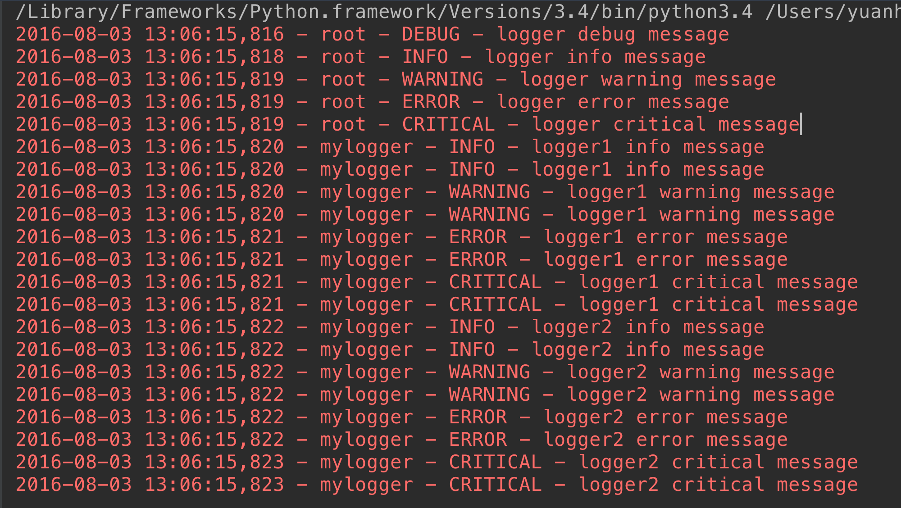

###python常用内置模块

#### 模块的概念:

在Python中，一个.py文件就称之为一个模块（Module）。

模块分3种

1 python标准库

2 第三方模块

3 自定义模块

- 模块的导入

import 语句

```
import module1,module2
```
==当我们使用import语句的时候，Python解释器是怎样找到对应的文件的呢？答案就是解释器有自己的搜索路径，存在sys.path里。==

```
[ 'G:\\py3\\py3\\py3\\venv\\Scripts\\python36.zip', 'C:\\Python36\\DLLs', 'C:\\Python36\\lib', 'C:\\Python36', 'G:\\py3\\py3\\py3\\venv', 'G:\\py3\\py3\\py3\\venv\\lib\\site-packages', 'G:\\py3\\py3\\py3\\venv\\lib\\site-packages\\setuptools-39.1.0-py3.6.egg', 'G:\\py3\\py3\\py3\\venv\\lib\\site-packages\\pip-10.0.1-py3.6.egg', 'C:\\Program Files\\JetBrains\\PyCharm 2018.2.3\\helpers\\pycharm_matplotlib_backend']
```

from .... import 语句

```
from module import  name1,name2
```

这个声明不会把整个modulename模块导入到当前的命名空间中，只会将它里面的name1或name2单个引入到执行这个声明的模块的全局符号表。

from ... import *

#### import运行本质

```
import test
from test import add
```

==无论1还是2，首先通过sys.path找到test.py,然后执行test脚本（全部执行），区别是1会将test这个变量名加载到名字空间，而2只会将add这个变量名加载进来。==　　

#### 包
如果不同的人编写的模块名相同怎么办？为了避免模块名冲突，Python又引入了按目录来组织模块的方法，称为包（Package）。
请注意，==每一个包目录下面都会有一个__init__.py的文件==，这个文件是必须存在的，否则，Python就把这个目录当成普通目录(文件夹)，而不是一个包。__init__.py可以是空文件，也可以有Python代码，因为__init__.py本身就是一个模块，而它的模块名就是对应包的名字。

==调用包就是执行包下的__init__.py文件==

#### 两个实例需要注意


```
##-------------cal.py
def add(x,y):
 
    return x+y
##-------------main.py
import cal      #from module import cal
 
def main():
 
    cal.add(1,2)
     
##--------------bin.py
from module import main
 
main.main()
```

```
当执行bin.py的时候,系统会将bin.py脚本路径(文件夹)加入到环境变量
# from module import cal 改成 from . import cal同样可以，这是因为bin.py是我们的执行脚本，
# sys.path里有bin.py的当前环境。即/Users/yuanhao/Desktop/whaterver/project/web这层路径，
# 无论import what ,  解释器都会按这个路径找。所以当执行到main.py时，import cal会找不到，因为
# sys.path里没有/Users/yuanhao/Desktop/whaterver/project/web/module这个路径，而
#  from  module/.  import cal 时，解释器就可以找到了。

```


#### 内置模块re

- 简介

正则表达式本身是一种小型的、高度专业化的编程语言，而在python中，通过内嵌集成re模块，程序媛们可以直接调用来实现正则匹配。正则表达式模式被编译成一系列的字节码，然后由用C编写的匹配引擎执行。

常用的一些正则

```
.   匹配任意除换行符"\n"外的字符(在DOTALL模式中也能匹配换行符
\   转义字符，使后一个字符改变原来的意思
*   匹配前一个字符0或多次
+   匹配前一个字符1次或无限次
?   匹配一个字符0次或1次
^   匹配字符串开头。在多行模式中匹配每一行的开头
$   匹配字符串末尾，在多行模式中匹配每一行的末尾
|   或。匹配|左右表达式任意一个，从左到右匹配，如果|没有包括在()中，则它的范围是整个正则表达式
{}  {m}匹配前一个字符m次，{m,n}匹配前一个字符m至n次，若省略n，则匹配m至无限次
[]  字符集。对应的位置可以是字符集中任意字符。字符集中的字符可以逐个列出，也可以给出范围，如[abc]或[a-c]。[^abc]表示取反，即非abc。
所有特殊字符在字符集中都失去其原有的特殊含义。用\反斜杠转义恢复特殊字符的特殊含义。
()  被括起来的表达式将作为分组，从表达式左边开始没遇到一个分组的左括号“（”，编号+1.
分组表达式作为一个整体，可以后接数量词。表达式中的|仅在该组中有效。

```
3 点

- 反斜杠后边跟元字符去除特殊功能；（即将特殊字符转义成普通字符）
- 反斜杠后边跟普通字符实现特殊功能；（即预定义字符）
- 引用序号对应的字组所匹配的字符串。
- 
```
a=re.search(r'(tina)(fei)haha\2','tinafeihahafei tinafeihahatina').group()
print(a)
结果：
tinafeihahafei

\2代表第二个分组(fei)
```
常用一些匹配

```
\d  数字:[0-9]
\D  非数字:[^\d]
\s  匹配任何空白字符
\S  非空白字符:[^\s]
\w  匹配包括下划线在内的任何字字符:[A-Za-z0-9_]
\W  匹配非字母字符，即匹配特殊字符
\A  仅匹配字符串开头,同^
\Z  仅匹配字符串结尾，同$
\b  匹配\w和\W之间，即匹配单词边界匹配一个单词边界，也就是指单词和空格间的位置。例如， 'er\b' 可以匹配"never" 中的 'er'，但不能匹配 "verb" 中的 'er'。(注意识别什么情况下是一个单词)
\B  [^\b]
```
对于\b的理解

```
这里需要强调一下\b的单词边界的理解：
w = re.findall('\btina','tian tinaaaa')
print(w)
s = re.findall(r'\btina','tian tinaaaa')
print(s)
v = re.findall(r'\btina','tian#tinaaaa')
print(v)
a = re.findall(r'\btina\b','tian#tina@aaa')
print(a)
k = re.findall(r'\btina','tiankktinaaaa')
print(k)
执行结果如下：
[]
['tina']
['tina']
['tina']
[]

一个单词的界限就是单词前后(紧邻单词)不在有字母
```
- 特殊分组

分组就是用一对圆括号“()”括起来的正则表达式，匹配出的内容就表示一个分组。从正则表达式的左边开始看，看到的第一个左括号“(”表示第一个分组，第二个表示第二个分组，依次类推，需要注意的是，有一个隐含的全局分组（就是0），就是整个正则表达式。 
分完组以后，要想获得某个分组的内容，直接使用group(num)和groups()函数去直接提取就行。

三种分组

```
(?P<name>正则表达式)#name是一个合法的标识符
>>> s = "ip='230.192.168.78',version='1.0.0'"
>>> re.search(r"ip='(?P<ip>\d+\.\d+\.\d+\.\d+).*", s)
>>> res.group('ip')#通过命名分组引用分组
'230.192.168.78'
当用”()”定义了一个正则表达式组后,正则引擎则会把被匹配的组按照顺序编号,存入缓存。这样我们想在后面对已经匹配过的内容进行引用时，就可以用”\数字”的方式或者是通过命名分组进行”(?P=name)“进行引用。\1表示引用第一个分组,\2引用第二个分组,以此类推,\n引用第n个组。而\0则引用整个被匹配的正则表达式本身。这些引用都必须是在正则表达式中才有效，用于匹配一些重复的字符串。

#通过命名分组进行后向引用
>>> re.search(r'(?P<name>go)\s+(?P=name)\s+(?P=name)', 'go go go').group('name')
'go'
#通过默认分组编号进行后向引用
>>> re.search(r'(go)\s+\1\s+\1', 'go go go').group()
'go go go'
```

#### re模块常用的函数

compile()

编译正则表达式模式，返回一个对象的模式。（可以把那些常用的正则表达式编译成正则表达式对象，这样可以提高一点效率。）

格式：

re.compile(pattern,flags=0)

pattern: 编译时用的表达式字符串。

flags 编译标志位，用于修改正则表达式的匹配方式，如：是否区分大小写，多行匹配等。常用的flags有：

```
标志含义
re.S(DOTALL)
使.匹配包括换行在内的所有字符
re.I（IGNORECASE）
使匹配对大小写不敏感
re.L（LOCALE）
做本地化识别（locale-aware)匹配，法语等
re.M(MULTILINE)
多行匹配，影响^和$
re.X(VERBOSE)
该标志通过给予更灵活的格式以便将正则表达式写得更易于理解
re.U
根据Unicode字符集解析字符，这个标志影响\w,\W,\b,\B
```
使用

```
import re
tt = "Tina is a good girl, she is cool, clever, and so on..."
rr = re.compile(r'\w*oo\w*')
print(rr.findall(tt))   #查找所有包含'oo'的单词
执行结果如下：
['good', 'cool']
```
match

```
print(re.match('com','comwww.runcomoob').group())
print(re.match('com','Comwww.runcomoob',re.I).group())
执行结果如下：
com
com
```

search

re.search(pattern, string, flags=0)

re.search函数会在字符串内查找模式匹配,只要找到第一个匹配然后返回，如果字符串没有匹配，则返回None。

```
print(re.search('\dcom','www.4comrunoob.5com').group())
执行结果如下：
4com
print(re.search('\dcom','www.deeeeeeee')
执行结果如下：
None
```
*注：match和search一旦匹配成功，就是一个match object对象，而match object对象有以下方法：

group() 返回被 RE 匹配的字符串

start() 返回匹配开始的位置
end() 返回匹配结束的位置

span() 返回一个元组包含匹配 (开始,结束) 的位置

group() 返回re整体匹配的字符串，可以一次输入多个组号，对应组号匹配的字符串。

a. group（）返回re整体匹配的字符串，

b. group (n,m) 返回组号为n，m所匹配的字符串，如果组号不存在，则返回indexError异常

c.groups（）

groups() 方法返回一个包含正则表达式中所有小组字符串的元组，从 1 到所含的小组号，通常groups()不需要参数，返回一个元组，元组中的元就是正则表达式中定义的组。 

```
import re
a = "123abc456"
 print(re.search("([0-9]*)([a-z]*)([0-9]*)",a).group(0))   #123abc456,返回整体
 print(re.search("([0-9]*)([a-z]*)([0-9]*)",a).group(1))   #123
 print(re.search("([0-9]*)([a-z]*)([0-9]*)",a).group(2))   #abc
 print(re.search("([0-9]*)([a-z]*)([0-9]*)",a).group(3))   #456
 print (re.search("([0-9]*)([a-z]*)([0-9]*)",a).groups()) #返回匹配的元祖('123','abc','456')
###group(1) 列出第一个括号匹配部分，group(2) 列出第二个括号匹配部分，group(3) 列出第三个括号匹配部分。###
```
4、findall()

re.findall遍历匹配，可以获取字符串中所有匹配的字符串，返回一个列表。

 格式：

re.findall(pattern, string, flags=0)

```
p = re.compile(r'\d+')
print(p.findall('o1n2m3k4'))
执行结果如下：
['1', '2', '3', '4']
```
5、finditer()

 搜索string，返回一个顺序访问每一个匹配结果（Match对象）的迭代器。找到 RE 匹配的所有子串，并把它们作为一个迭代器返回。

格式：

re.finditer(pattern, string, flags=0)

```
iter = re.finditer(r'\d+','12 drumm44ers drumming, 11 ... 10 ...')
for i in iter:
    print(i)
    print(i.group())
    print(i.span())
执行结果如下：
<_sre.SRE_Match object; span=(0, 2), match='12'>
12
(0, 2)
<_sre.SRE_Match object; span=(8, 10), match='44'>
44
(8, 10)
<_sre.SRE_Match object; span=(24, 26), match='11'>
11
(24, 26)
<_sre.SRE_Match object; span=(31, 33), match='10'>
10
(31, 33)
```
6、split()

按照能够匹配的子串将string分割后返回列表。

可以使用re.split来分割字符串，如：re.split(r'\s+', text)；将字符串按空格分割成一个单词列表。

格式：

re.split(pattern, string[, maxsplit])

```
print(re.split('\d+','one1two2three3four4five5'))
执行结果如下：
['one', 'two', 'three', 'four', 'five', '']
```
7、sub()

使用re替换string中每一个匹配的子串后返回替换后的字符串。

格式：

re.sub(pattern, repl, string, count)

```
text = "JGood is a handsome boy, he is cool, clever, and so on..."
print(re.sub(r'\s+', '-', text))
执行结果如下：
JGood-is-a-handsome-boy,-he-is-cool,-clever,-and-so-on...
其中第二个函数是替换后的字符串；本例中为'-'

第四个参数指替换个数。默认为0，表示每个匹配项都替换。
```
参考：https://www.cnblogs.com/tina-python/p/5508402.html


#### 内置模块2----->  os

os.getcwd()：查看当前所在路径。

os.listdir(path):列举目录下的所有文件。返回的是列表类型。
```
os.listdir('G:\py3\py3'))
```

os.path.abspath(path):返回path的绝对路径。
```
(os.path.abspath('.'))

```
查看路径的文件夹部分和文件名部分

os.path.split(path):将路径分解为(文件夹,文件名)，返回的是元组类型
os.path.split(path):将路径分解为(文件夹,文件名)，返回的是元组类型。可以看出，若路径字符串最后一个字符是\,则只有文件夹部分有值；若路径字符串中均无\,则只有文件名部分有值。若路径字符串有\，且不在最后，则文件夹和文件名均有值。且返回的文件夹的结果不包含\.

```
os.path.split('G:\py3\py3\py3\复习\test1.py')
```

os.path.join(path1,path2,...):将path进行组合，若其中有绝对路径，则之前的path将被删除。

```
print (os.path.join('G:\py3\py3\py3','test1.py'))
=====>:G:\py3\py3\py3\test1.py
```
os.path.dirname(path):返回path中的文件夹部分，结果不包含'\'
```
os.path.dirname('G:\py3\py3\py3')
print (os.path.dirname('/opt/unilog/gggg/')) #注意有/结尾的情况
print (os.path.dirname('/opt/unilog/gggg/1.txt'))

输出===》G:\py3\py3
        /opt/unilog
        /opt/unilog/gggg

```
 os.path.basename(path):返回path中的文件名。
 
```
print (os.path.basename('/opt/unilog/gggg/1.txt'))
====>  1.txt
```
查看文件大小

os.path.getsize(path):文件或文件夹的大小，若是文件夹返回0。
```
print (os.path.getsize(os.path.join(os.getcwd(),'test1.py')))
```
查看文件是否存在
os.path.exists(path):文件或文件夹是否存在，返回True 或 False。

os.chdir()改变当前工作目录
```
os.chdir('/home/sy')
result = os.getcwd()
print(result)
```
os.mkdir()  创建文件夹
```
os.mkdir('girls')
```
os.rmdir() 删除空目录

```
#os.rmdir('girls')
```
os.rename() 文件或文件夹重命名

```
os.rename('/home/sy/a','/home/sy/alibaba')
os.rename('02.txt','002.txt')
```
os.stat() 获取文件或者文件夹的信息
```
result = os.stat('/home/sy/PycharmProject/Python3/10.27/01.py)
print(result)
```
os.system() 执行系统命令(危险函数)
```
result = os.system('ls -al')  #获取隐藏文件
print(result)
```
os.getenv() 获取系统的环境变量
```
result = os.getenv('PATH')
```
os.putenv() 将一个目录添加到环境变量中(临时增加仅对当前脚本有效)
```
os.putenv('PATH','/home/sy/下载')
```
os.name 获取代表操作系统的名称字符串
```
print(os.name) #posix -> linux或者unix系统  nt -> window系统
```
os.walk()

```
os.walk(top，topdown = True，onerror = None，followlinks = False )
通过从上到下或从下到上遍历树来生成目录树中的文件名。对于以目录顶部（包括顶部本身）为根的树中的每个目录 ，它产生一个3元组。
(dirpath, dirnames, filenames)——>dirpath是一个字符串，即目录的路径。 dirnames中是子目录的名称列表中的dirpath（不包括'.'和'..'）。 filenames是dirpath中非目录文件的名称列表。请注意，列表中的名称不包含路径组件。要获取完整路径（以top开头）到dirpath中的文件或目录。
```
```
for dirName,subDir,files in os.walk('G:\py3\py3\py3\day33'):
    print (dirName)
    print (subDir)
    print (files)
```
#### 常用内置模块之---->datetime

获取现在时间
```
from datetime import datetime
print (datetime.now())
-->:2019-04-14 21:18:28.604079
```
获取指定日期和时间
```
dt = datetime(2019,4,8,23,10)
print (dt)
---->:2019-04-08 23:10:00
```
datetime转时间戳
```
dt = datetime(2019,4,8,23,10)
print (dt.timestamp())
--->:1554736200.0
```
时间戳转换为datetime
```
ct=1527800000
print (datetime.fromtimestamp(ct))
--->:2018-06-01 04:53:20
```

#### 模块之---->time

1 返回当前时间戳
```
time.time()
```
2 localtime([secs])
 将一个时间戳转换为当前时区的struct_time。secs参数未提供，则以当前时间为准。
 ```
 time.localtime(time.time())
 --->:time.struct_time(tm_year=2019, tm_mon=4, tm_mday=16, tm_hour=21, tm_min=35, tm_sec=43, tm_wday=1, tm_yday=106, tm_isdst=0)
 ```
3 gmtime([secs]) 和localtime()方法类似，gmtime()方法是将一个时间戳转换为UTC时区（0时区）的struct_time。
 ```
 time.gmtime(time.time())
 ```
4 mktime(t) : 将一个struct_time转化为时间戳。
```
time.mktime(time.localtime())
```
5 asctime([t]) : 把一个表示时间的元组或者struct_time表示为这种形式：'Sun Jun 20 23:21:05 1993'。
如果没有参数，将会将time.localtime()作为参数传入。
```
time.asctime()
-->:Tue Apr 16 21:45:10 2019
```
6 ctime([secs]) : 把一个时间戳（按秒计算的浮点数）转化为time.asctime()的形式。如果参数未给或者为
None的时候，将会默认time.time()为参数。它的作用相当于time.asctime(time.localtime(secs))。
```
time.ctime()
-->:Tue Apr 16 21:45:10 2019
```
 7 strftime(format[, t]) : 把一个代表时间的元组或者struct_time（如由time.localtime()和
time.gmtime()返回）转化为格式化的时间字符串。如果t未指定，将传入time.localtime()。如果元组中任何一个元素越界，ValueError的错误将会被抛出。

```
time.strftime("%Y-%m-%d %X", time.localtime())
-->:2019-04-16 21:56:53
传入时间元祖
print (time.strftime("%Y-%m-%d %X",(2009, 2, 17, 10, 48, 39,23,1,2,)))
-->:2009-02-17 10:48:39
```
8 time.strptime(string[, format])
把一个格式化时间字符串转化为struct_time。实际上它和strftime()是逆操作。
```
print(time.strptime('2011-05-05 16:37:06', '%Y-%m-%d %X'))
--->:time.struct_time(tm_year=2011, tm_mon=5, tm_mday=5, tm_hour=16, tm_min=37, tm_sec=6, tm_wday=3, tm_yday=125, tm_isdst=-1)
```

###### 常见format格式
```
格式	含义
%a	本地（locale）简化星期名称
%A	本地完整星期名称
%b	本地简化月份名称
%B	本地完整月份名称
%c	本地相应的日期和时间表示
%d	一个月中的第几天（01 - 31）
%H	一天中的第几个小时（24小时制，00 - 23）
%I	第几个小时（12小时制，01 - 12）
%j	一年中的第几天（001 - 366）
%m	月份（01 - 12）
%M	分钟数（00 - 59）
%p	本地am或者pm的相应符
%S	秒（01 - 61）
%U	一年中的星期数。（00 - 53星期天是一个星期的开始。）第一个星期天之前的所有天数都放在第0周。
%w	一个星期中的第几天（0 - 6，0是星期天）
%W	和%U基本相同，不同的是%W以星期一为一个星期的开始。
%x	本地相应日期
%X	本地相应时间
%y	去掉世纪的年份（00 - 99）
%Y	完整的年份
%Z	时区的名字（如果不存在为空字符）
%%	‘%’字符
```

常用的转化

#### 文件处理模块-->configparser模块

生成某种格式的文档

```
import configparser
  
config = configparser.ConfigParser()
config["DEFAULT"] = {'ServerAliveInterval': '45',
                      'Compression': 'yes',
                     'CompressionLevel': '9'}
  
config['bitbucket.org'] = {}
config['bitbucket.org']['User'] = 'hg'
config['topsecret.server.com'] = {}
topsecret = config['topsecret.server.com']
topsecret['Host Port'] = '50022'     # mutates the parser
topsecret['ForwardX11'] = 'no'  # same here
config['DEFAULT']['ForwardX11'] = 'yes'<br>
with open('example.ini', 'w') as configfile:
   config.write(configfile)
```
生成的文档如下

```
[DEFAULT]
ServerAliveInterval = 45
Compression = yes
CompressionLevel = 9
ForwardX11 = yes
  
[bitbucket.org]
User = hg
  
[topsecret.server.com]
Port = 50022
ForwardX11 = no
```

对文档的一些操作

```
import configparser

config = configparser.ConfigParser()

#---------------------------------------------查
print(config.sections())   #[]

config.read('example.ini')

print(config.sections())   #['bitbucket.org', 'topsecret.server.com']
#拿到[]里面的值,但是第一个DEFAULT是拿不到的,换成其他的可以拿到

print('bytebong.com' in config)# False

print(config['bitbucket.org']['User']) # hg

print(config['DEFAULT']['Compression']) #yes

print(config['topsecret.server.com']['ForwardX11'])  #no


for key in config['bitbucket.org']:
    print(key)


# user
# serveraliveinterval
# compression
# compressionlevel
# forwardx11


print(config.options('bitbucket.org'))#['user', 'serveraliveinterval', 'compression', 'compressionlevel', 'forwardx11']
print(config.items('bitbucket.org'))  #[('serveraliveinterval', '45'), ('compression', 'yes'), ('compressionlevel', '9'), ('forwardx11', 'yes'), ('user', 'hg')]

print(config.get('bitbucket.org','compression'))#yes


#--------------删,改,增(config.write(open('i.cfg', "w")))


config.add_section('yuan')#增加sections

config.remove_section('topsecret.server.com')
config.remove_option('bitbucket.org','user')

config.set('bitbucket.org','k1','11111')

config.write(open('i.cfg', "w"))


```
#### 日志模块之-------logging

- 简单应用

```
import logging  
logging.debug('debug message')  
logging.info('info message')  
logging.warning('warning message')  
logging.error('error message')  
logging.critical('critical message')  
```
输出
```
WARNING:root:warning message
ERROR:root:error message
CRITICAL:root:critical message
```
可见，默认情况下Python的logging模块将日志打印到了标准输出中，且只显示了大于等于WARNING级别的日志，这说明默认的日志级别设置为WARNING（日志级别等级CRITICAL > ERROR > WARNING > INFO > DEBUG > NOTSET），默认的日志格式为日志级别：Logger名称：用户输出消息。

- 二  灵活配置日志级别，日志格式，输出位置
- 
```
import logging  
logging.basicConfig(level=logging.DEBUG,  
                    format='%(asctime)s %(filename)s[line:%(lineno)d] %(levelname)s %(message)s',  
                    datefmt='%a, %d %b %Y %H:%M:%S',  
                    filename='/tmp/test.log',  
                    filemode='w')  
  
logging.debug('debug message')  
logging.info('info message')  
logging.warning('warning message')  
logging.error('error message')  
logging.critical('critical message')
```

查看输出：
```
cat /tmp/test.log 
Mon, 05 May 2014 16:29:53 test_logging.py[line:9] DEBUG debug message
Mon, 05 May 2014 16:29:53 test_logging.py[line:10] INFO info message
Mon, 05 May 2014 16:29:53 test_logging.py[line:11] WARNING warning message
Mon, 05 May 2014 16:29:53 test_logging.py[line:12] ERROR error message
Mon, 05 May 2014 16:29:53 test_logging.py[line:13] CRITICAL critical message
```

可见在logging.basicConfig()函数中可通过具体参数来更改logging模块默认行为，可用参数有

filename：用指定的文件名创建FiledHandler（后边会具体讲解handler的概念），这样日志会被存储在指定的文件中。

filemode：文件打开方式，在指定了filename时使用这个参数，默认值为“a”还可指定为“w”。

format：指定handler使用的日志显示格式。 

datefmt：指定日期时间格式。 

level：设置rootlogger（后边会讲解具体概念）的日志级别 

stream：用指定的stream创建StreamHandler。可以指定输出到sys.stderr,sys.stdout或者文件(f=open('test.log','w'))，默认为sys.stderr。若同时列出了filename和stream两个参数，则stream参数会被忽略。

format参数中可能用到的格式化串：
```
%(name)s Logger的名字
%(levelno)s 数字形式的日志级别
%(levelname)s 文本形式的日志级别
%(pathname)s 调用日志输出函数的模块的完整路径名，可能没有
%(filename)s 调用日志输出函数的模块的文件名
%(module)s 调用日志输出函数的模块名
%(funcName)s 调用日志输出函数的函数名
%(lineno)d 调用日志输出函数的语句所在的代码行
%(created)f 当前时间，用UNIX标准的表示时间的浮 点数表示
%(relativeCreated)d 输出日志信息时的，自Logger创建以 来的毫秒数
%(asctime)s 字符串形式的当前时间。默认格式是 “2003-07-08 16:49:45,896”。逗号后面的是毫秒
%(thread)d 线程ID。可能没有
%(threadName)s 线程名。可能没有
%(process)d 进程ID。可能没有
%(message)s用户输出的消息
```
###### 三  logger对象

    上述几个例子中我们了解到了logging.debug()、logging.info()、logging.warning()、logging.error()、logging.critical()（分别用以记录不同级别的日志信息），logging.basicConfig()（用默认日志格式（Formatter）为日志系统建立一个默认的流处理器（StreamHandler），设置基础配置（如日志级别等）并加到root logger（根Logger）中）这几个logging模块级别的函数，另外还有一个模块级别的函数是logging.getLogger([name])（返回一个logger对象，如果没有指定名字将返回root logger）

先看一个最简单的过程：
```
import logging

logger = logging.getLogger()
# 创建一个handler，用于写入日志文件
fh = logging.FileHandler('test.log')

# 再创建一个handler，用于输出到控制台
ch = logging.StreamHandler()

formatter = logging.Formatter('%(asctime)s - %(name)s - %(levelname)s - %(message)s')

fh.setFormatter(formatter)
ch.setFormatter(formatter)

logger.addHandler(fh) #logger对象可以添加多个fh和ch对象
logger.addHandler(ch)

logger.debug('logger debug message')
logger.info('logger info message')
logger.warning('logger warning message')
logger.error('logger error message')
logger.critical('logger critical message')
```
  先简单介绍一下，logging库提供了多个组件：Logger、Handler、Filter、Formatter。Logger对象提供应用程序可直接使用的接口，Handler发送日志到适当的目的地，Filter提供了过滤日志信息的方法，Formatter指定日志显示格式。

     (1)

      Logger是一个树形层级结构，输出信息之前都要获得一个Logger（如果没有显示的获取则自动创建并使用root Logger，如第一个例子所示）。
      logger = logging.getLogger()返回一个默认的Logger也即root Logger，并应用默认的日志级别、Handler和Formatter设置。
当然也可以通过Logger.setLevel(lel)指定最低的日志级别，可用的日志级别有logging.DEBUG、logging.INFO、logging.WARNING、logging.ERROR、logging.CRITICAL。

Logger.debug()、Logger.info()、Logger.warning()、Logger.error()、Logger.critical()输出不同级别的日志，只有日志等级大于或等于设置的日志级别的日志才会被输出。 
```
logger.debug('logger debug message')  
logger.info('logger info message')  
logger.warning('logger warning message')  
logger.error('logger error message')  
logger.critical('logger critical message') 
```
只输出了
2014-05-06 12:54:43,222 - root - WARNING - logger warning message
2014-05-06 12:54:43,223 - root - ERROR - logger error message
2014-05-06 12:54:43,224 - root - CRITICAL - logger critical message
从这个输出可以看出logger=logging.getLogger()返回的Logger名为root。这里没有用logger.setLevel(logging.Debug)显示的为logger设置日志级别，所以使用默认的日志级别WARNIING，故结果只输出了大于等于WARNIING级别的信息。

(2) 如果我们再创建两个logger对象： 
```
##################################################
logger1 = logging.getLogger('mylogger')
logger1.setLevel(logging.DEBUG)

logger2 = logging.getLogger('mylogger')
logger2.setLevel(logging.INFO)

logger1.addHandler(fh)
logger1.addHandler(ch)

logger2.addHandler(fh)
logger2.addHandler(ch)

logger1.debug('logger1 debug message')
logger1.info('logger1 info message')
logger1.warning('logger1 warning message')
logger1.error('logger1 error message')
logger1.critical('logger1 critical message')
  
logger2.debug('logger2 debug message')
logger2.info('logger2 info message')
logger2.warning('logger2 warning message')
logger2.error('logger2 error message')
logger2.critical('logger2 critical message')
```
结果如下

这里有两个个问题：

 <1>我们明明通过logger1.setLevel(logging.DEBUG)将logger1的日志级别设置为了DEBUG，为何显示的时候没有显示出DEBUG级别的日志信息，而是从INFO级别的日志开始显示呢？

 原来logger1和logger2对应的是同一个Logger实例，只要logging.getLogger（name）中名称参数name相同则返回的Logger实例就是同一个，且仅有一个，也即name与Logger实例一一对应。在logger2实例中通过logger2.setLevel(logging.INFO)设置mylogger的日志级别为logging.INFO，所以最后logger1的输出遵从了后来设置的日志级别。
 
 
<2>为什么logger1、logger2对应的每个输出分别显示两次?

 这是因为我们通过logger = logging.getLogger()显示的创建了root Logger，而logger1 = logging.getLogger('mylogger')创建了root Logger的孩子(root.)mylogger,logger2同样。而孩子,孙子，重孙……既会将消息分发给他的handler进行处理也会传递给所有的祖先Logger处理。
 
  ok,那么现在我们把
```

# logger.addHandler(fh)

# logger.addHandler(ch)  注释掉，我们再来看效果：
```


因为我们注释了logger对象显示的位置，所以才用了默认方式，即标准输出方式。因为它的父级没有设置文件显示方式，所以在这里只打印了一次。

孩子,孙子，重孙……可逐层继承来自祖先的日志级别、Handler、Filter设置，也可以通过Logger.setLevel(lel)、Logger.addHandler(hdlr)、Logger.removeHandler(hdlr)、Logger.addFilter(filt)、Logger.removeFilter(filt)。设置自己特别的日志级别、Handler、Filter。若不设置则使用继承来的值。


#### subprocess模块

##### 简介

当我们需要调用系统的命令的时候，最先考虑的os模块。用os.system()和os.popen()来进行操作。但是这两个命令过于简单，不能完成一些复杂的操作，如给运行的命令提供输入或者读取命令的输出，判断该命令的运行状态，管理多个命令的并行等等。这时subprocess中的Popen命令就能有效的完成我们需要的操作。
subprocess模块允许一个进程创建一个新的子进程，通过管道连接到子进程的stdin/stdout/stderr，获取子进程的返回值等操作。 

参数如下
```
subprocess.Popen(args, bufsize=0, executable=None, stdin=None, stdout=None,stderr=None, preexec_fn=None, close_fds=False, shell=False,<br>                 cwd=None, env=None, universal_newlines=False, startupinfo=None, creationflags=0)
```

参数说明：

```
# 参数args可以是字符串或者序列类型（如：list，元组），用于指定进程的可执行文件及其参数。
# 如果是序列类型，第一个元素通常是可执行文件的路径。我们也可以显式的使用executeable参
# 数来指定可执行文件的路径。在windows操作系统上，Popen通过调用CreateProcess()来创
# 建子进程,CreateProcess接收一个字符串参数，如果args是序列类型，系统将会通过
# list2cmdline()函数将序列类型转换为字符串。
# 
# 
# 参数bufsize：指定缓冲。我到现在还不清楚这个参数的具体含义，望各个大牛指点。
# 
# 参数executable用于指定可执行程序。一般情况下我们通过args参数来设置所要运行的程序。如
# 果将参数shell设为True，executable将指定程序使用的shell。在windows平台下，默认的
# shell由COMSPEC环境变量来指定。
# 
# 参数stdin, stdout, stderr分别表示程序的标准输入、输出、错误句柄。他们可以是PIPE，
# 文件描述符或文件对象，也可以设置为None，表示从父进程继承。
# 
# 参数preexec_fn只在Unix平台下有效，用于指定一个可执行对象（callable object），它将
# 在子进程运行之前被调用。
# 
# 参数Close_sfs：在windows平台下，如果close_fds被设置为True，则新创建的子进程将不会
# 继承父进程的输入、输出、错误管道。我们不能将close_fds设置为True同时重定向子进程的标准
# 输入、输出与错误(stdin, stdout, stderr)。
# 
# 如果参数shell设为true，程序将通过shell来执行。
# 
# 参数cwd用于设置子进程的当前目录。
# 
# 参数env是字典类型，用于指定子进程的环境变量。如果env = None，子进程的环境变量将从父
# 进程中继承。
# 
# 参数Universal_newlines:不同操作系统下，文本的换行符是不一样的。如：windows下
# 用’/r/n’表示换，而Linux下用’/n’。如果将此参数设置为True，Python统一把这些换行符当
# 作’/n’来处理。
# 
# 参数startupinfo与createionflags只在windows下用效，它们将被传递给底层的
# CreateProcess()函数，用于设置子进程的一些属性，如：主窗口的外观，进程的优先级等等。

```
一些简单命令

```
import subprocess
 
a=subprocess.Popen('ls')#  创建一个新的进程,与主进程不同步
 
print('>>>>>>>',a)#a是Popen的一个实例对象
 
'''
>>>>>>> <subprocess.Popen object at 0x10185f860>
__init__.py
__pycache__
log.py
main.py
 
'''
 
# subprocess.Popen('ls -l',shell=True)
 
# subprocess.Popen(['ls','-l'])
```

##### subprocess.PIPE

在创建Popen对象时，subprocess.PIPE可以初始化stdin, stdout或stderr参数。表示与子进程通信的标准流。

```
import subprocess
# subprocess.Popen('ls')
p=subprocess.Popen('ls',stdout=subprocess.PIPE)#结果跑哪去啦?
print(p.stdout.read())#这这呢:b'__pycache__\nhello.py\nok.py\nweb\n'
```
subprocess.STDOUT

创建Popen对象时，用于初始化stderr参数，表示将错误通过标准输出流输出。

一般常见写法

```
p=subprocess.Popen('ls',stdout=subprocess.PIPE,stderr=subprocess.PIPE,stdin=subprocess.PIPE,shell=True)

取出结果
p.stdout.read()
p.stderr.read()
```

其他的一些用法

```
Popen.poll() 
用于检查子进程是否已经结束。设置并返回returncode属性。

Popen.wait() 
等待子进程结束。设置并返回returncode属性。

Popen.communicate(input=None)
与子进程进行交互。向stdin发送数据，或从stdout和stderr中读取数据。可选参数input指定发送到子进程的参数。 Communicate()返回一个元组：(stdoutdata, stderrdata)。注意：如果希望通过进程的stdin向其发送数据，在创建Popen对象的时候，参数stdin必须被设置为PIPE。同样，如 果希望从stdout和stderr获取数据，必须将stdout和stderr设置为PIPE。

Popen.send_signal(signal) 
向子进程发送信号。

Popen.terminate()
停止(stop)子进程。在windows平台下，该方法将调用Windows API TerminateProcess（）来结束子进程。

Popen.kill()
杀死子进程。

Popen.stdin 
如果在创建Popen对象是，参数stdin被设置为PIPE，Popen.stdin将返回一个文件对象用于策子进程发送指令。否则返回None。

Popen.stdout 
如果在创建Popen对象是，参数stdout被设置为PIPE，Popen.stdout将返回一个文件对象用于策子进程发送指令。否则返回 None。

Popen.stderr 
如果在创建Popen对象是，参数stdout被设置为PIPE，Popen.stdout将返回一个文件对象用于策子进程发送指令。否则返回 None。

Popen.pid 
获取子进程的进程ID。

Popen.returncode 
获取进程的返回值。如果进程还没有结束，返回None。
```
#### subprocess模块的工具函数

```
subprocess模块提供了一些函数，方便我们用于创建进程来实现一些简单的功能。
 
subprocess.call(*popenargs, **kwargs)
运行命令。该函数将一直等待到子进程运行结束，并返回进程的returncode。如果子进程不需要进行交 互,就可以使用该函数来创建。
 
subprocess.check_call(*popenargs, **kwargs)
与subprocess.call(*popenargs, **kwargs)功能一样，只是如果子进程返回的returncode不为0的话，将触发CalledProcessError异常。在异常对象中，包 括进程的returncode信息。
 
check_output(*popenargs, **kwargs)
与call()方法类似，以byte string的方式返回子进程的输出，如果子进程的返回值不是0，它抛出CalledProcessError异常，这个异常中的returncode包含返回码，output属性包含已有的输出。
 
getstatusoutput(cmd)/getoutput(cmd)
这两个函数仅仅在Unix下可用，它们在shell中执行指定的命令cmd，前者返回(status, output)，后者返回output。其中，这里的output包括子进程的stdout和stderr。
```

实例如下

```
import subprocess

#1
# subprocess.call('ls',shell=True)
'''
hello.py
ok.py
web
'''
# data=subprocess.call('ls',shell=True)
# print(data)
'''
hello.py
ok.py
web
'''

#2
# subprocess.check_call('ls',shell=True)

'''
hello.py
ok.py
web
'''
# data=subprocess.check_call('ls',shell=True)
# print(data)
'''
hello.py
ok.py
web
'''
# 两个函数区别:只是如果子进程返回的returncode不为0的话，将触发CalledProcessError异常
#3
# subprocess.check_output('ls')#无结果
# data=subprocess.check_output('ls')
# print(data)  #b'hello.py\nok.py\nweb\n'
演示
```
#### 加密模块之--hashlib模块

用于加密相关的操作，3.x里代替了md5模块和sha模块，主要提供 SHA1, SHA224, SHA256, SHA384, SHA512 ，MD5 算法

```
import hashlib
 
m=hashlib.md5()# m=hashlib.sha256()
 
m.update('hello'.encode('utf8'))
print(m.hexdigest())  #5d41402abc4b2a76b9719d911017c592
 
m.update('alvin'.encode('utf8'))
 
print(m.hexdigest())  #92a7e713c30abbb0319fa07da2a5c4af
 
m2=hashlib.md5()
m2.update('helloalvin'.encode('utf8'))
print(m2.hexdigest()) #92a7e713c30abbb0319fa07da2a5c4af
```

以上加密算法虽然依然非常厉害，但有时候存在缺陷，即：通过撞库可以反解。所以，有必要对加密算法中添加自定义key再来做加密。

```
import hashlib
# ######## 256 ########
hash = hashlib.sha256('898oaFs09f'.encode('utf8'))
hash.update('alvin'.encode('utf8'))
print (hash.hexdigest())#e79e68f070cdedcfe63eaf1a2e92c83b4cfb1b5c6bc452d214c1b7e77cdfd1c7

```
python 还有一个 hmac 模块，它内部对我们创建 key 和 内容 再进行处理然后再加密:

```
import hmac
h = hmac.new('alvin'.encode('utf8'))
h.update('hello'.encode('utf8'))
print (h.hexdigest())#320df9832eab4c038b6c1d7ed73a5940

```

#### 常用模块之json

json

如果我们要在不同的编程语言之间传递对象，就必须把对象序列化为标准格式，比如XML，但更好的方法是序列化为JSON，因为JSON表示出来就是一个字符串，可以被所有语言读取，也可以方便地存储到磁盘或者通过网络传输。JSON不仅是标准格式，并且比XML更快，而且可以直接在Web页面中读取，非常方便。

案例

```
#----------------------------序列化
import json
dic={'name':'alvin','age':23,'sex':'male'}
print(type(dic))#<class 'dict'>
j=json.dumps(dic)
>>> '{"age": 23, "name": "alvin", "sex": "male"}'
print(type(j))#<class 'str'>

反序列化将json字符串转换为字典
a='{"age": 23, "name": "alvin", "sex": "male"}'
print type(a)  --->  str
json.loads(a)
->>>:{u'age': 23, u'name': u'alvin', u'sex': u'male'}

json.dump   json.load

a = {"name":"Tom", "age":23}
with open("test.json", "w", encoding='utf-8') as f:
    # indent 超级好用，格式化保存字典，默认为None，小于0为零个空格
    f.write(json.dumps(a, indent=4))
    # json.dump(a,f,indent=4)   # 和上面的效果一样


---------------------
import json
with open("test.json", "r", encoding='utf-8') as f:
    aa = json.loads(f.read())
    f.seek(0)
    bb = json.load(f)    # 与 json.loads(f.read())
print(aa)
print(bb)
    
```
注意事项

```
import json
#dct="{'1':111}"#json 不认单引号
#dct=str({"1":111})#报错,因为生成的数据还是单引号:{'one': 1}

dct='{"1":"111"}'
print(json.loads(dct))

#conclusion:
#        无论数据是怎样创建的，只要满足json格式，就可以json.loads出来,不一定非要dumps的数据才能loads
```

#### pickle模块

pickle 模块也提供了四个功能：dumps、dump、loads、load，但是Pickle的问题和所有其他编程语言特有的序列化问题一样，就是它只能用于Python，并且可能不同版本的Python彼此都不兼容，因此，只能用Pickle保存那些不重要的数据，不能成功地反序列化也没关系。

```
##----------------------------序列化
import pickle
dic={'name':'alvin','age':23,'sex':'male'}
print(type(dic))#<class 'dict'>
 
j=pickle.dumps(dic)
print(type(j))#<class 'bytes'>
f=open('序列化对象_pickle','wb')#注意是w是写入str,wb是写入bytes,j是'bytes'
f.write(j)  #-------------------等价于pickle.dump(dic,f)
 
f.close()
#-------------------------反序列化
import pickle
f=open('序列化对象_pickle','rb')
 
data=pickle.loads(f.read())#  等价于data=pickle.load(f)
print(data['age'])    
```

#### sys模块

```
sys.argv           命令行参数List，第一个元素是程序本身路径
sys.exit(n)        退出程序，正常退出时exit(0)
sys.version        获取Python解释程序的版本信息
sys.maxint         最大的Int值
sys.path           返回模块的搜索路径，初始化时使用PYTHONPATH环境变量的值
sys.platform       返回操作系统平台名称
```


