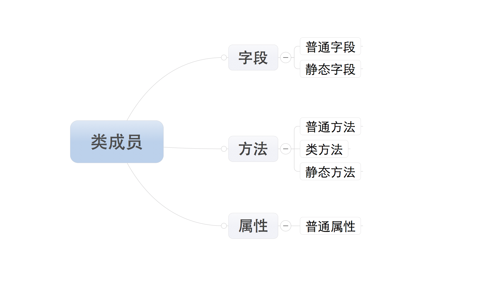

### 面向对象进阶

#### 类的成员

类成员包含字段,方法,属性


==所有成员中，只有普通字段的内容保存对象中，即：根据此类创建了多少对象，在内存中就有多少个普通字段。而其他的成员，则都是保存在类中，即：无论对象的多少，在内存中只创建一份。==

#### 字段

字段包括：普通字段和静态字段，他们在定义和使用中有所区别，而最本质的区别是内存中保存的位置不同，


- 普通字段属于对象
- 静态字段属于类
- 
简单实例

```
class Province:

    # 静态字段
    country ＝ '中国'

    def __init__(self, name):

        # 普通字段
        self.name = name


# 直接访问普通字段
obj = Province('河北省')
print obj.name

# 直接访问静态字段
Province.country

字段的定义和使用
```

存储图如下


- 静态字段在内存中只保存一份
- 普通字段在每个对象中都要保存一份

#### 方法

方法包括：普通方法、静态方法和类方法，三种方法在内存中都归属于类，区别在于调用方式不同。

- 普通方法：由对象调用；至少一个self参数；执行普通方法时，自动将调用该方法的对象赋值给self；
- 类方法：由类调用； 至少一个cls参数；执行类方法时，自动将调用该方法的类复制给cls；
- 静态方法：由类调用；无默认参数；

 
实现方法如下：

```
class Foo:

    def __init__(self, name):
        self.name = name

    def ord_func(self):
        """ 定义普通方法，至少有一个self参数 """

        # print self.name
        print '普通方法'

    @classmethod
    def class_func(cls):
        """ 定义类方法，至少有一个cls参数 """

        print '类方法'

    @staticmethod
    def static_func():
        """ 定义静态方法 ，无默认参数"""

        print '静态方法'


# 调用普通方法
f = Foo()
f.ord_func()

# 调用类方法
Foo.class_func()

# 调用静态方法
Foo.static_func()

```

#### 属性

1、属性的基本使用

```
# ############### 定义 ###############
class Foo:

    def func(self):
        pass

    # 定义属性
    @property
    def prop(self):
        pass
# ############### 调用 ###############
foo_obj = Foo()

foo_obj.func()
foo_obj.prop   #调用属性

属性的定义和使用
```

由属性的定义和调用要注意一下几点：

- 定义时，在普通方法的基础上添加 @property 装饰器；
- 定义时，属性仅有一个self参数
- 调用时，无需括号
  方法：foo_obj.func()
  属性：foo_obj.prop

注意：属性存在意义是：访问属性时可以制造出和访问字段完全相同的假象

属性由方法变种而来，如果Python中没有属性，方法完全可以代替其功能。

实例探索,简单的分页功能

```
# ############### 定义 ###############
class Pager:
    
    def __init__(self, current_page):
        # 用户当前请求的页码（第一页、第二页...）
        self.current_page = current_page
        # 每页默认显示10条数据
        self.per_items = 10 


    @property
    def start(self):
        val = (self.current_page - 1) * self.per_items
        return val

    @property
    def end(self):
        val = self.current_page * self.per_items
        return val

# ############### 调用 ###############

p = Pager(1)
p.start 就是起始值，即：m
p.end   就是结束值，即：n
```
2、属性的两种定义方式

属性的定义有两种方式：

- 装饰器 即：在方法上应用装饰器
- 静态字段 即：在类中定义值为property对象的静态字段

装饰器方式：在类的普通方法上应用@property装饰器

我们知道Python2.7中的类有经典类和新式类，(然而在3中全部是新式类)新式类的属性比经典类的属性丰富。（ 如果类继object，那么该类是新式类 ）
经典类，具有一种@property装饰器（如上一步实例）

```
# ############### 定义 ###############    
class Goods:

    @property
    def price(self):
        return "wupeiqi"
# ############### 调用 ###############
obj = Goods()
result = obj.price  # 自动执行 @property 修饰的 price 方法，并获取方法的返回值
```

新式类，具有三种@property装饰器

```
# ############### 定义 ###############
class Goods(object):

    @property
    def price(self):
        print '@property'

    @price.setter
    def price(self, value):
        print '@price.setter'

    @price.deleter
    def price(self):
        print '@price.deleter'

# ############### 调用 ###############
obj = Goods()

obj.price          # 自动执行 @property 修饰的 price 方法，并获取方法的返回值

obj.price = 123    # 自动执行 @price.setter 修饰的 price 方法，并将  123 赋值给方法的参数

del obj.price      # 自动执行 @price.deleter 修饰的 price 方法
```

注：经典类中的属性只有一种访问方式，其对应被 @property 修饰的方法
      新式类中的属性有三种访问方式，并分别对应了三个被@property、@方法名.setter、@方法名.deleter修饰的方法

由于新式类中具有三种访问方式，我们可以根据他们几个属性的访问特点，分别将三个方法定义为对同一个属性：获取、修改、删除

```
class Goods(object):

    def __init__(self):
        # 原价
        self.original_price = 100
        # 折扣
        self.discount = 0.8

    @property
    def price(self):
        # 实际价格 = 原价 * 折扣
        new_price = self.original_price * self.discount
        return new_price

    @price.setter
    def price(self, value):
        self.original_price = value

    @price.deltter
    def price(self, value):
        del self.original_price

obj = Goods()
obj.price         # 获取商品价格
obj.price = 200   # 修改商品原价
del obj.price     # 删除商品原价

实例
```

静态字段方式，创建值为property对象的静态字段

当使用静态字段的方式创建属性时，经典类和新式类无区别


```
class Foo:

    def get_bar(self):
        return 'wupeiqi'

    BAR = property(get_bar)

obj = Foo()
reuslt = obj.BAR        # 自动调用get_bar方法，并获取方法的返回值
print reuslt
```

==property的构造方法中有个四个参数==

```

第一个参数是方法名，调用 对象.属性 时自动触发执行方法
第二个参数是方法名，调用 对象.属性 ＝ XXX 时自动触发执行方法
第三个参数是方法名，调用 del 对象.属性 时自动触发执行方法
第四个参数是字符串，调用 对象.属性.__doc__ ，此参数是该属性的描述信息

```

实例

```
class Foo：

    def get_bar(self):
        return 'wupeiqi'

    # *必须两个参数
    def set_bar(self, value): 
        return return 'set value' + value

    def del_bar(self):
        return 'wupeiqi'

    BAR ＝ property(get_bar, set_bar, del_bar, 'description...')

obj = Foo()

obj.BAR              # 自动调用第一个参数中定义的方法：get_bar
obj.BAR = "alex"     # 自动调用第二个参数中定义的方法：set_bar方法，并将“alex”当作参数传入
del Foo.BAR          # 自动调用第三个参数中定义的方法：del_bar方法
obj.BAE.__doc__      # 自动获取第四个参数中设置的值：description...
```

==由于静态字段方式创建属性具有三种访问方式，我们可以根据他们几个属性的访问特点，分别将三个方法定义为对同一个属性：获取、修改、删除==

```
class Goods(object):

    def __init__(self):
        # 原价
        self.original_price = 100
        # 折扣
        self.discount = 0.8

    def get_price(self):
        # 实际价格 = 原价 * 折扣
        new_price = self.original_price * self.discount
        return new_price

    def set_price(self, value):
        self.original_price = value

    def del_price(self, value):
        del self.original_price

    PRICE = property(get_price, set_price, del_price, '价格属性描述...')

obj = Goods()
obj.PRICE         # 获取商品价格
obj.PRICE = 200   # 修改商品原价
del obj.PRICE     # 删除商品原价

```

实现类型检测功能

```

#实现类型检测功能

#第一关：
class People:
    def __init__(self,name):
        self.name=name

    @property
    def name(self):
        return self.name

# p1=People('alex') #property自动实现了set和get方法属于数据描述符,比实例属性优先级高,所以你这面写会触发property内置的set,抛出异常


#第二关：修订版

class People:
    def __init__(self,name):
        self.name=name #实例化就触发property

    @property
    def name(self):
        # return self.name #无限递归
        print('get------>')
        return self.DouNiWan

    @name.setter
    def name(self,value):
        print('set------>')
        self.DouNiWan=value

    @name.deleter
    def name(self):
        print('delete------>')
        del self.DouNiWan

p1=People('alex') #self.name实际是存放到self.DouNiWan里
print(p1.name)
print(p1.name)
print(p1.name)
print(p1.__dict__)

p1.name='egon'
print(p1.__dict__)

del p1.name
print(p1.__dict__)


#第三关:加上类型检查
class People:
    def __init__(self,name):
        self.name=name #实例化就触发property

    @property
    def name(self):
        # return self.name #无限递归
        print('get------>')
        return self.DouNiWan

    @name.setter
    def name(self,value):
        print('set------>')
        if not isinstance(value,str):
            raise TypeError('必须是字符串类型')
        self.DouNiWan=value

    @name.deleter
    def name(self):
        print('delete------>')
        del self.DouNiWan

p1=People('alex') #self.name实际是存放到self.DouNiWan里
p1.name=1

```

#### 类成员修饰符


- 公有成员，在任何地方都能访问
- 私有成员，只有在类的内部才能方法
- 
私有成员和公有成员的定义不同：私有成员命名时，前两个字符是下划线。（特殊成员除外，例如：__init__、__call__、__dict__等）

```

class C:
 
    def __init__(self):
        self.name = '公有字段'
        self.__foo = "私有字段"
```

静态字段

- 公有静态字段：类可以访问；类内部可以访问；派生类中可以访问
- 私有静态字段：仅类内部可以访问；
- 

公有静态字段
```

class C:

    name = "公有静态字段"

    def func(self):
        print C.name

class D(C):

    def show(self):
        print C.name


C.name         # 类访问

obj = C()
obj.func()     # 类内部可以访问

obj_son = D()
obj_son.show() # 派生类中可以访问


```

私有静态字段
```
class C:

    __name = "公有静态字段"

    def func(self):
        print C.__name

class D(C):

    def show(self):
        print C.__name


C.__name       # 类访问            ==> 错误

obj = C()
obj.func()     # 类内部可以访问     ==> 正确

obj_son = D()
obj_son.show() # 派生类中可以访问   ==> 错误


```

普通字段

- 公有普通字段：对象可以访问；类内部可以访问；派生类中可以访问
- 私有普通字段：仅类内部可以访问；

ps：如果想要强制访问私有字段，可以通过 【对象._类名__私有字段明 】访问（如：obj._C__foo），不建议强制访问私有成员。

私有字段访问

```
class C:
    
    def __init__(self):
        self.__foo = "私有字段"

    def func(self):
        print self.foo 　#　类内部访问

class D(C):
    
    def show(self):
        print self.foo　＃　派生类中访问

obj = C()

obj.__foo     # 通过对象访问    ==> 错误
obj.func()  # 类内部访问        ==> 正确

obj_son = D();
obj_son.show()  # 派生类中访问  ==> 错误

```


